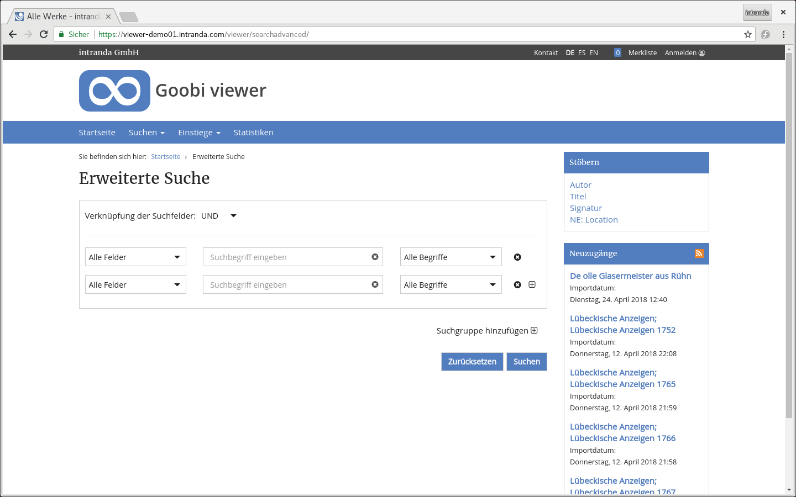

# 2.17.3 Erweiterte Suche

Es existiert eine erweiterte Suche, bei der gezielt in einzelnen Metadatenfeldern gesucht werden kann.



Die Konfiguration hierfür findet folgendermaßen statt:

```markup
<search>
    <advanced>
        <enabled>true</enabled>
        <defaultItemNumber>2</defaultItemNumber>
        <searchFields>
            <field>DEFAULT</field>
            <field>FULLTEXT</field>
            <field>OVERVIEWPAGE</field>
            <field>PI_TOPSTRUCT</field>
            <field>DOCSTRCT</field>
            <field>MD_TITLE</field>
            <field>MD_PUBLISHER</field>
            <field>MD_SHELFMARK</field>
            <field>MD_YEARPUBLISH</field>
            <field hierarchical=”true”>DC</field>
        </searchFields>
   </advanced>
</search>
```

| **enabled**  | Schaltet die erweiterte Suche an oder ab. Der Standardwert ist `true` |
| --- | --- | --- |
| **defaultItemNumber** | Anzahl der angezeigten Suchfelder |
| **searchFields**  | Indexfelder, die für die durchsuchbar sein sollen \(Diese stehen zur Auswahl im Drop-Down Menü\). Die Auswahl `Alle Felder` gibt es immer. Diese Auswahl bewirkt, dass der entsprechende Begriff über alle Metadaten und Volltext- Felder gesucht wird \(und auch in nutzergenerierten Inhalten, falls Crowdsourcing Modul aktiviert ist - analog zur Standardsuche „in allen Daten“. Zusätzlich können die Felder `DEFAULT` \(Suche in Metadaten\) und `FULLTEXT` \(Suche in Volltexten\) definiert werden, um entsprechende Filterung auch in der erweiterten Suche zu ermöglichen. Achtung: das Feld `PI_TOPSTRUCT` muss hier definiert sein, damit die  Suche innerhalb eines Werkes funktioniert. Wenn das Element das Attribut `hierarchical=“true“` besitzt, wird in dieser Zeile statt eines Eingabefeldes automatisch eine hierarchisch sortierte Liste der im Index vorhandenen Kollektionen als Drop-Down-Menü angezeigt.  |

