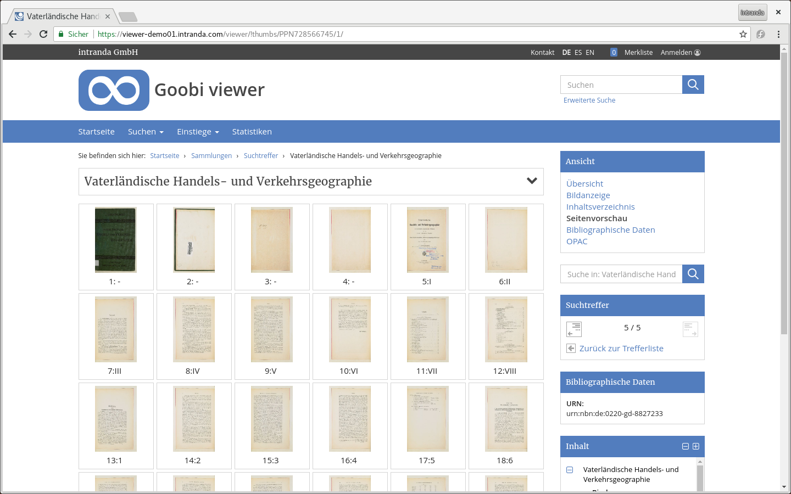

# 2.11.7 Thumbnail Einstellungen

Der Goobi viewer bietet die Möglichkeit, dass sämtliche Seiten eines Werkes in einer Vorschauansicht in Form sogenannter Thumbnails angezeigt werden.



Die folgende Option legt die Anzahl von Thumbnails fest, die maximal auf einer Seite der Seitenvorschau angezeigt werden dürfen \(Standard ist 10\):

```markup
<viewer>
    <thumbnailsPerPage>30</thumbnailsPerPage>
</viewer>
```

Standardmäßig werden Thumbnail Versionen von Bildern in der Seitenvorschau mit einer Bildgröße von 100x120 Pixel angezeigt. Diese Größe kann mit folgenden Konfigurationselementen geändert werden:

```markup
<viewer>
    <thumbnailsWidth>400</thumbnailsWidth>
    <thumbnailsHeight>400</thumbnailsHeight>
</viewer>
```

FIXME 

```markup
<viewer>
    <thumbnailsCompression>85</thumbnailsCompression>
</viewer>
```

Für mehrbändige Werke, Zeitschriften und andere Werke mit Anchor gibt es für das in den Suchtreffern angezeigte Thumbnail zwei Varianten.  Zum einen kann ein generisches Bild angezeigt werden \(`GENERIC`\), zum anderen der Repräsentant des ersten enthaltenen Werkes oder Bandes \(`FIRSTVOLUME`\). Standardwert ist `GENERIC`:

```markup
<viewer>
    <anchorThumbnailMode>GENERIC</anchorThumbnailMode>
</viewer>
```


