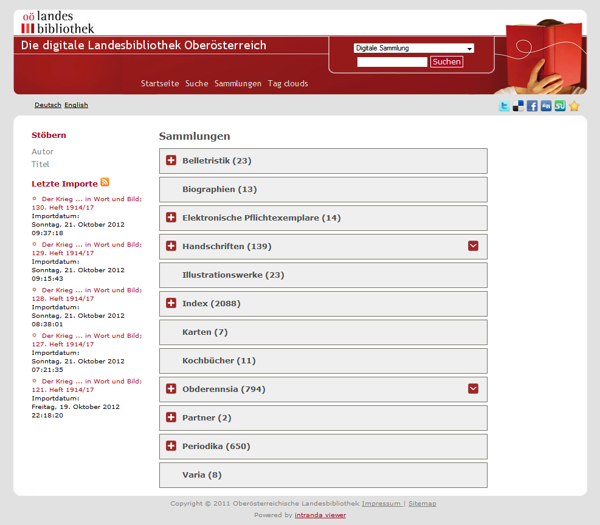

# 2.25 RSS Feed

Ihr Goobi viewer bietet die Möglichkeit, die letzten Importe in einem RSS Feed zur Verfügung zu stellen. Zusätzlich kann in der Seitenleiste eine Übersicht über die letzten fünf Importe angezeigt werden.



Die Anzahl der Einträge im RSS Feed lässt sich mit dem folgenden Konfigurationselement definieren \(Standardwert ist `50`\):

```markup
<numberOfItems>50</numberOfItems>
```


Der Titel des RSS Feeds \(sowohl im Feed als auch in der Seitenleiste\) wird folgendermaßen definiert \(Standardwert ist `viewer-rss`\):

```markup
<title>digiverso RSS Feed</title>
```


Beschreibungstext für den RSS Feed \(Standardwert ist `latest imports`\):

```markup
<description>latest imports</description>
```


Copyright Text für den RSS Feed \(kein Standardwert\): 

```markup
<copyright>(c)intranda GmbH 2010-2012</copyright>
```

