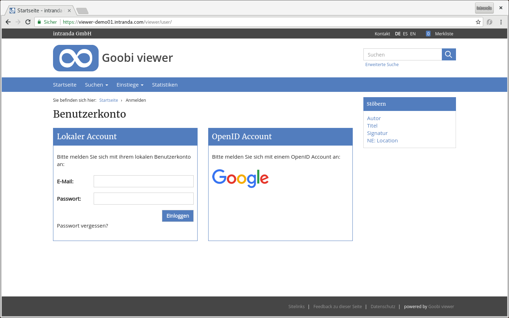

# 2.5 Benutzeraccounts

Der Goobi viewer hat einen Benutzerbereich, der erst nach vorheriger Authentifizierung zugänglich ist. Für die Anmeldung stehen zwei Wege zur Verfügung. Diese sind in den Unterkapiteln [OpenID Connect](2.6.1-openid-connect-authentifizierungs-einstellungen.md) und [lokaler Benutzeraccount](2.6.2-mail-einstellungen.md) beschrieben.

Unabhängig von der gewählten Authentifizierungsart kann das Registrieren von neuen Accounts oder das Passwort zurücksetzen deaktiviert werden. Dazu dient der folgende Konfiguratonsschalter:

```markup
<user>
    <userRegistrationEnabled>true</userRegistrationEnabled>
</user>
```



