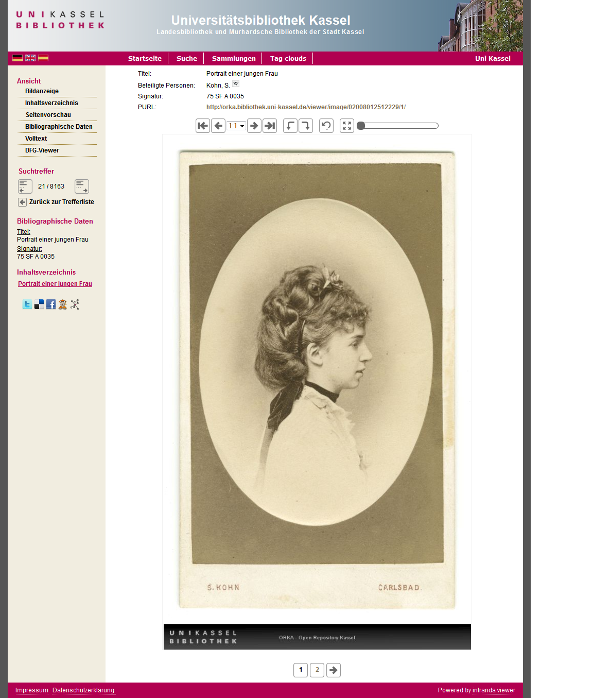

# 2.11.9 Bildspiegel

Der Bildspiegel, der wahlweise unterhalb des Bildes gerendert wird, enthält einen Text, der folgendermaßen konfiguriert wird.

```markup
<viewer>
     <watermarkTextConfiguration>
           <text>SOLR:MD_COPYRIGHT</text>
           <text>urn</text>
           <text>purl</text>
     </watermarkTextConfiguration>
</viewer>
```

Die Werte `urn` und `purl` für &lt;text&gt; sind reservierte Wörter \(Groß-/Kleinschreibung spielt keine Rolle\).

Werte, die mit `SOLR:` anfangen, gefolgt vom Namen eines existierenden Solr Metadatenfeldes, bewirken, dass das entsprechende Feld im Hauptdokument des Objekts ausgewertet wird - bei Vorhandensein wird dessen Wert in das Watermark geschrieben. Alle anderen Werte werden 1:1 in das Watermark geschrieben. Im letzteren Fall sollte darauf geachtet werden, dass der eingegebene Text nicht zu lang für das Watermark ist. 

Es können in Abhängigkeit des Wertes eines Feldes im Solr Suchindex alternative Bildspiegel gerendert werden. Der Feldname wird in der config\_viewer.xml wie folgt definiert:

```markup
<viewer>
    <watermarkIdField>DC</watermarkIdField>
</viewer>
```

Der Inhalt des Feldes kann dann in der config\_imageFooter.xml ausgelesen werden. Dafür muss die folgende Struktur vorhanden sein:

```markup
<watermarks>
    <watermark id=“Wert1“ height=“50“ width=“500“ color=“CCCCCC“>
    [...]
    </watermark>
    <watermark id=“Wert2“ height=“50“ width=“500“ color=“CCCCCC“>
    [...]
    </watermark>
    <watermark id=“Wert3“ height=“50“ width=“500“ color=“CCCCCC“>
    [...]
    </watermark>
    <watermark id=“default“ height=“50“ width=“500“ color=“CCCCCC“>
    [...]
    </watermark>
</watermarks>
```

Der Inhalt des Attributs id="" entspricht dabei dem Wert des Indexfeldes, ansonsten greift die Konfiguration mit `id=“default“`.

Bildspiegel, die für `height` oder `width` einen Wert von 0 haben, werden nicht gerendert.



Die `text`-Elemente werden dabei in der angegebenen Reihenfolge auf Machbarkeit überprüft. Im obigen Beispiel wird zuerst überprüft, ob eine URN für das aktuelle Bild existiert. Falls ja, wird die URN in den Footer gerendert, alle anderen Möglichkeiten werden übersprungen. Falls nein, wird das nächste Element ausgewertet \(PURL\). Da die PURL in jedem Fall generiert werden kann, würden alle nachfolgenden `text`-Elemente ignoriert.

