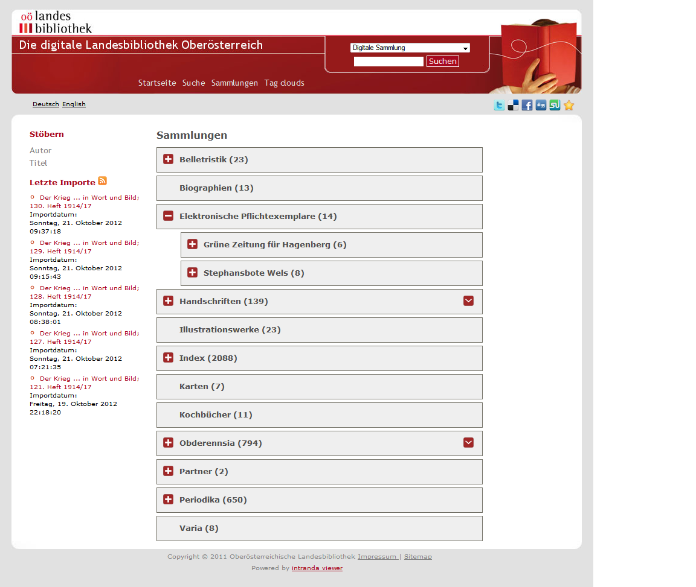

# 2.8.6 Anzeige der Kollektionsgröße

Die Größe einer Kollektion ist die Anzahl der darin enthaltenen Objekte. In der Kollektionsübersicht wird diese Zahl standardmäßig in Klammern hinter dem Namen der einzelnen Hierarchiestufe der Kollektion angezeigt. 



Soll diese Anzeige nicht beziehungsweise erst ab einer der unteren Hierarchiestufen erwünscht sein, steht hierfür dieses Konfigurationselement zur Verfügung:

```markup
<collections>
      <collection field=”DC”>
              <displayNumberOfVolumesLevel>1</displayNumberOfVolumesLevel>
      </collection>
</collections>
```

Die Zahl `displayNumberOfVolumesLevel` steht für die höchste Hierarchiestufe, für die die Kollektionsgröße angezeigt werden soll. Dabei ist 0 die höchste Stufe, 1 die zweite Stufe, etc. Bei darüberliegenden Hierarchiestufen wird die Größe nicht angezeigt.

Soll die Größe für gar keine Hierarchiestufe angezeigt werden, kann eine unrealistische Zahl konfiguriert werden, die größer als die Hierarchietiefe ist \(etwa 999\). Standardwert ist `0`.

