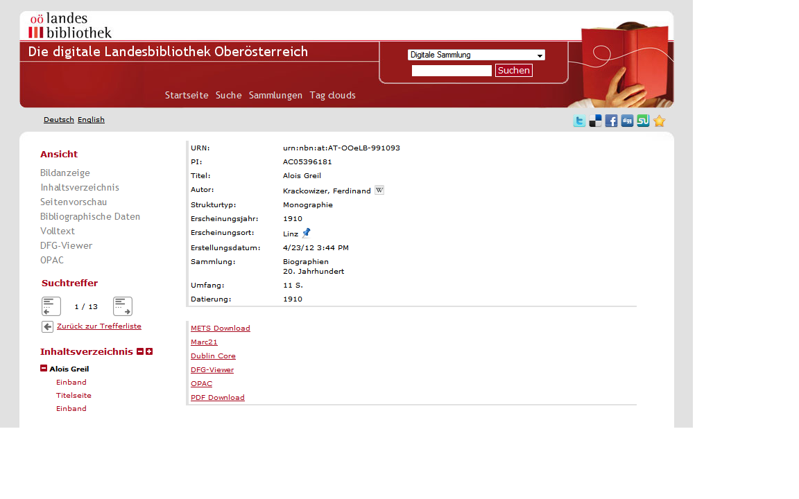
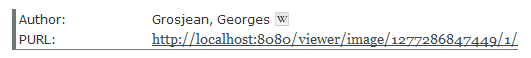

# 2.14.1 Haupt-Metadaten

Die Liste der Haupt-Metadaten \(das heißt Metadaten, die auf der Seite “Bibliographische Daten” angezeigt werden\) können wie folgt konfiguriert werden:

```markup
<metadata>
      <mainMetadataList>
            <template name="_DEFAULT">
                  <metadata label="MD_TITLE" value="">
                        <param type="field" key="MD_TITLE" />
                  </metadata>
                  <metadata label="MD_AUTHOR" value="LINK_WIKIPEDIA">
                        <param type="field" key="MD_AUTHOR" />
                        <param type="wikifield" key="MD_AUTHOR" />
                  </metadata>
                  <metadata label="URN " value="">
                        <param type="field" key="URN" />
                  </metadata>
            </template>
            <template name="monograph">
                  <metadata label="MD_TITLE" value="">
                        <param type="field" key="MD_TITLE" />
                  </metadata>
                  <metadata label="MD_AUTHOR" value="LINK_WIKIPEDIA">
                        <param type="field" key="MD_AUTHOR" />
                        <param type="wikifield" key="MD_AUTHOR" />
                  </metadata>
            </template>
      </mainMetadataList>
</metadata>
```

Hier kann abhängig von dem angezeigten Strukturtyp unterschiedliche Konfigurationen verwendet werden. Die Konfigurationen werden dabei jeweils in einem Element `template>` platziert. Im obigen Beispiel ist für den Strukturtyp monograph eine eigene Metadatenliste konfiguriert.

Metadaten für LIDO-Events werden ebenfalls über diese Liste konfiguriert. Gewünschte Event-Metadaten müssen hier also ebenfalls aufgelistet sein.

Jedes Element `<metadata>` beschreibt ein Metadatenfeld, das angezeigt werden soll. Die Reihenfolge der Auflistung entspricht dabei der Reihenfolge, in der diese Metadaten \(falls vorhanden\) angezeigt werden. Das Element hat folgende Attribute:

| **label** | Der Key für die Bezeichnung dieses Metadatenfeldes \(die Übersetzung für diesen Key muss in der jeweiligen **messages.properties** vorhanden sein\) |
| --- | --- |
| **value** | Standardwert des Metadatums. Dieser Wert kann etwa eine URL sein, die in der messages.properties definiert ist und Platzhalter enthält, die durch tatsächliche Werte aus dem Metadatum ersetzt werden \(siehe die Konfiguration von **MD\_AUTHOR** im obigen Beispiel\). Für einfache Metadaten sollte dieses Attribut leer gelassen werden \(siehe die Konfiguration von **MD\_TITLE** im obigen Beispiel\). |



Jedes Element `<metadata>` muss mindestens ein Element `<param>` enthalten. Diese definieren die Quelle der tatsächlichen Werte für diesen Metadatentyp. Folgende Attribute sind dabei zu konfigurieren:

| **type** | Der Typ des Werts beschreibt die Art, ob und wie der Wert behandelt wird. Mögliche Typen sind: field\(Der Wert wird so wie er ist übernommen\),  **translatedfield** \(Wert wird gegebenenfalls in die aktuelle Sprache übersetzt, falls eine Übersetzung existiert\), **unescapedfield** \(es wird kein HTML-Unescaping am Wert vorgenommen\), **wikifield** \(Anpassung des Werts für eine Suchanfrage bei Wikipedia: Klammern werden entfernt, Leerzeichen durch Unterstriche ersetzt\), **wikipersonfield** \(wie wikifield, aber wenn der Wert ein Komma enthält, werden zusätzlich die Strings vor und nach dem Komma vertauscht, so dass Personennamen in das Muster first name\_last name für korrektes Wikipedia Resolving überführt werden\). |
| --- | --- | --- | --- | --- |
| **key** | Das Feld im Solr Index, dass den gewünschten Wert enthält |
| **prefix** | Zeichenkette, die unmittelbar vor dem Wert des Metadatums stehen soll \(Leerzeichen werden mit \_SPACE\_ kodiert\). |
| **suffix** | Zeichenkette, die unmittelbar nach dem Wert des Metadatums stehen soll \(Leerzeichen werden mit \_SPACE\_kodiert\). |
| **value** | Überschreibt den im &lt;metadata&gt; Element angegebenen value="" unter der Bedingung, dass der in diesem param konfigurierte key="" einen Wert hat. |

Die Reihenfolge der `<param>` Elemente entspricht der Reihenfolge, in der die Platzhalter im Standardwert \(falls konfiguriert\) ersetzt werden. Schauen Sie sich das folgende Beispiel an:  
`messages_en.properties` enthält zum Beispiel diesen Eintrag:

```text
LINK_WIKIPEDIA={0} <a href\="http\://de.wikipedia.org/wiki/{1}" target\="_blank"></a>,
```

Der Key `LINK_WIKIPEDIA` enthält ein vollständiges HTML Fragment mit einer Wikipedia URL, die wiederum zwei Platzhalter `{0}` und `{1}` enthält.

Die Metadaten-Konfiguration für `MD_AUTHOR` \(siehe erstes Beispiel\) enthält zwei `<param>` Elemente: ein `field` und ein `wikifield`. Der unveränderte Wert in field ersetzt dabei `{0}` \(der angezeigte Name\). Derselbe Wert als wikifield wird für Wikipedal Konformität formatiert und ersetzt `{1}` \(Teil der URL\). Das Ergebnis besteht dann aus dem Namen des Autors, gefolgt von einem Wikipedia Icon, das nach folgender URL verlinkt:

```text
http://en.wikipedia.org/wiki/Georges_Grosjean
```



