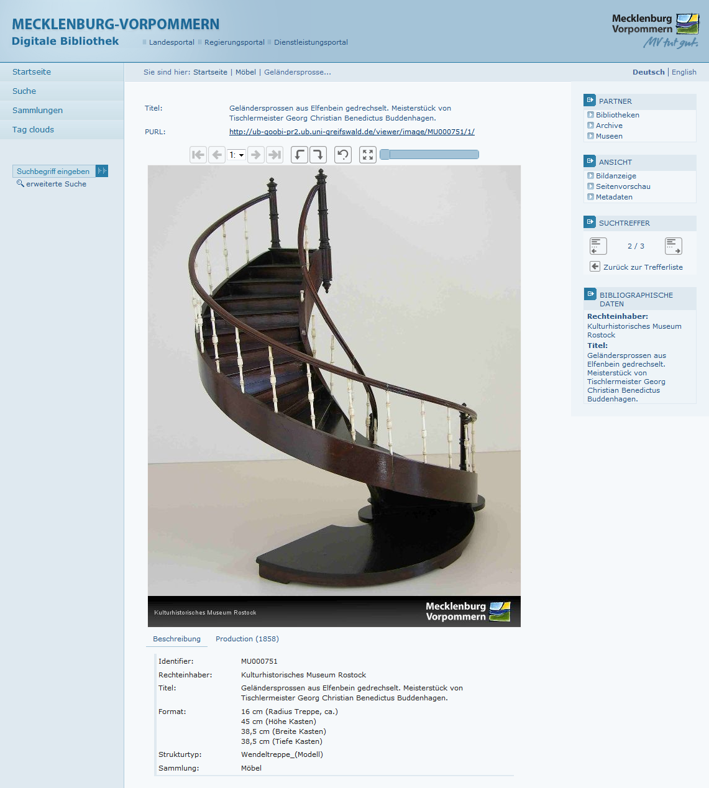

# 2.14.5 Metadaten-Anzeige von musealen Objekten

Für die Darstellung der Metadaten von musealen Objekten gibt es eine alternative Metadaten-Ansicht. Dabei werden Metadaten direkt unterhalb der Bildanzeige in Reitern gruppiert dargestellt.



Zunächst müssen die auf diese Weise darzustellenden Strukturtypen definiert werden:

```markup
<metadata>
      <museumDocstructTypes>
             <docStruct>Painting</docStruct>
             <docStruct>Sculpture</docStruct>
             <docStruct>Coin</docStruct>
      </museumDocstructTypes>
</metadata>
```

Um die Metadaten nach eigenem Bedarf auf unterschiedliche Reiter zu verteilen, gibt es in der Konfiguration der [Haupt-Metadaten](2.9.1-haupt-metadaten.md) das Attribut `type` im Element `<metadata>`:

```markup
<metadata>
   <mainMetadataList>
         <metadata label="MD_TITLE" value="" type="0">
               <param type="field" key="MD_TITLE" />
         </metadata>
         <metadata label="MD_AUTHOR" value="LINK_WIKIPEDIA" type="0">
               <param type="field" key="MD_AUTHOR" />
               <param type="wikifield" key="MD_AUTHOR" />
         </metadata>
         <metadata label="MD_LOCATION" value="" type="2">
               <param type="field" key="MD_LOCATION" />
         </metadata>
   </mainMetadataList>
</metadata>
```

  
Der Wert des Attributs `type` enthält dabei die Nummer des Reiters, in dem das Metadatum angezeigt werden soll \(beginnend mit 0 für den ersten Reiter\). Fehlt dieses Attribut, wird automatisch der Wert 0 verwendet.

Titel für die einzelnen Reiter werden in der `messages.properties` nach dem Muster `metadataTab<Nummer>` konfiguriert:

```text
metadataTab0=Beschreibung
metadataTab1=Inhalt
metadataTab2=Weitere Informationen
```


Metadaten von Events \(nur aus LIDO-Datensätzen\) werden in der musealen Ansicht als zusätzliche Reiter hinter den regulären Metadaten Reitern dargestellt.


