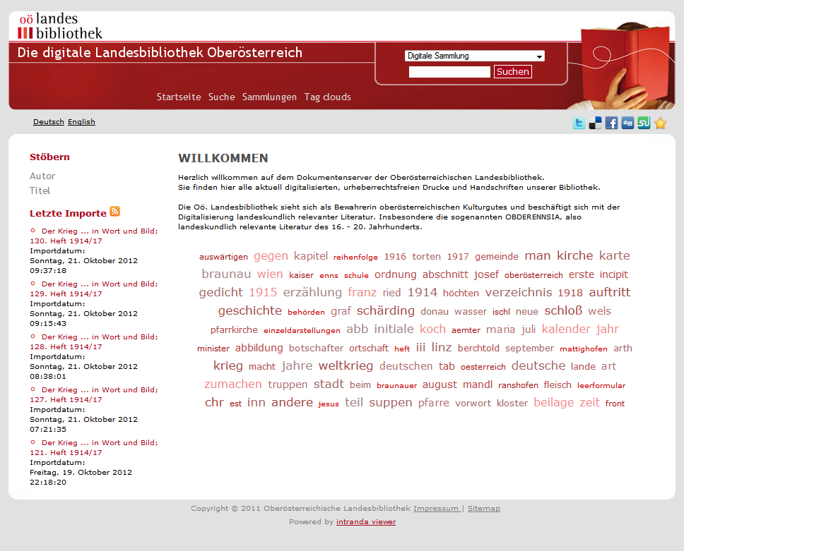

# 2.4 Internationalisierung mittels messages\_\*.properties

Die meisten Textelemente im Goobi viewer liegen mehrsprachig in `messages_*.properties` Dateien vor. Diese einzelnen Textelemente können über lokale `messages_*.properties` Dateien überschrieben werden \(jeweils eine Datei für jede unterstützte Sprache\), um Standard-Bezeichnungen an Ihre individuellen Anforderungen anzupassen. Diese Textelemente können etwa die Bezeichnungen der Links und Überschriften oder auch ganze Textpassagen, wie Ihr Willkommenstext, sein. 



Zusätzlich werden Bezeichnungen für Ihre digitalen Kollektionen, Metadaten und Strukturelemente in den lokalen `messages_*.properties` Dateien definiert, da diese meist kundenspezifisch und somit nicht in Standard-Message-Dateien enthalten sind. Um Ihren Besuchern unpräzise \(oder unklare\) Bezeichnungen zu ersparen, sollten Sie für jede Ihrer Kollektionen, Metadaten- und Strukturtypen Einträge in den lokalen `messages_*.properties` Dateien anlegen \(Muster: `Schlüssel=Wert`\).

Ein Beispiel lautet folgendermaßen:

```text
MD_TITLE=Title
```

Der obige Eintrag in `messages_de.properties` bewirkt, dass im Goobi Viewer für die Nutzer, die Deutsch als Sprache ausgewählt haben, die Bezeichnung `Titel` angezeigt wird, anstatt des Solr-Feldnamen`MD_TITLE`. Für jede unterstützte Sprache muss ein Eintrag für den Schlüssel `MD_TITLE` in der jeweiligen Datei vorhanden sein. Bei Sprachen ohne einen entsprechenden Eintrag wird dem Nutzer stattdessen der Schlüssel `MD_TITLE` angezeigt.


Falls ein einfacher Texteditor für das Bearbeiten von messages.properties Dateien verwendet wird, müssen nicht-ASCII Zeichen mit ihrer entsprechenden Unicode-Sequenz maskiert angegeben \(‚escaped’\) werden:


```text
AttachedWork=Beigef\u00FCgtes Werk
```

Definiert für den Strukturtyp `AttachedWork` die Bezeichnung `Beigefügtes Werk`.

