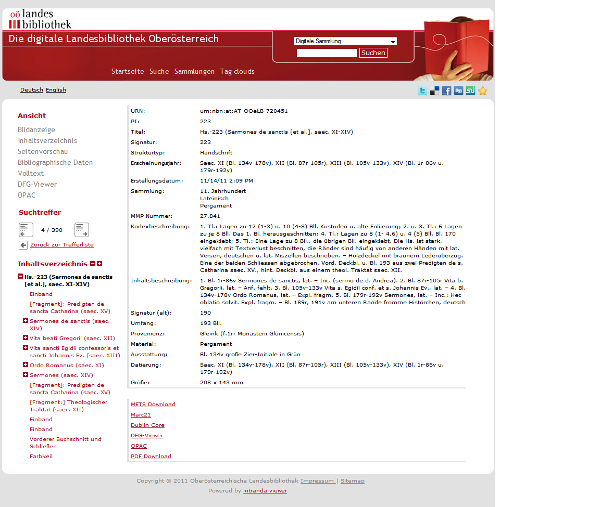

# 2.05. URL Konfiguration

Der Goobi viewer bietet an mehreren Stellen die Möglichkeit, zu externen Systemen zu verlinken. An dieser Stelle werden entsprechend diejenigen Parameter erläutert, die für diese Verlinkung zuständig sind.



Folgende Elemente enthalten absolute URLs zum aktuell angezeigten Werk über die OAI-Schnittstelle im METS, MARCXML oder Dublin Core Format. Der Goobi viewer fügt jeweils den Identifier des aktuellen Werks an diese URL an.

```markup
<mets>http://localhost:8080/viewer/oai?verb=GetRecord&amp;metadataPrefix=mets&amp;identifier=</mets>
<marc>http://localhost:8080/viewer/oai?verb=GetRecord&amp;metadataPrefix=marcxml&amp;identifier=</marc>
<dc>http://localhost:8080/viewer/oai?verb=GetRecord&amp;metadataPrefix=oai_dc&amp;identifier=</dc>
```


Absolute URL zum Apache Solr. Der Solr Index ist die Haupt-Datenquelle für den Goobi viewer. Aus Performanzgründen sollte sich dieser auf derselben Maschine bzw. im lokalen Netzwerk befinden.

```markup
<solr>http://localhost:8080/solr</solr>
```


Relative URL zur ContentServer Bibliothek, die das Bildmaterial für den Goobi viewer liefert.  
Die absolute URL ist in der Regel [http://www.example.com/viewer/cs\)](http://www.example.com/viewer/cs%29#).

Aus Sicherheitsgründen sollte diese URL nur lokal erreichbar sein.

```markup
<contentServer>/</contentServer>
```


Externe URL des ContentServer.  
Dieser Wrapper führt zusätzliche Überprüfungen durch, etwa Zugriffsrechte auf zugriffsbeschränkte Bilder oder die maximal zulässige Bildgröße.

```markup
<contentServerWrapper>http://localhost:8080/viewer/content</contentServerWrapper>
```


Absolute URL zum DFG Viewer.

```markup
<dfg-viewer>http://dfg-viewer.de/show?set[mets]=</dfg-viewer>
```


Im Folgenden die Basis-Url für die Bild-Auslieferung über iiif. Sie bezieht sich auf die Webapplication, in der das iiif-interface implementiert ist. Der default-Wert ist oben angegeben und bezieht sich auf den viewer selbst.

```markup
<iiif>http://localhost:8080/viewer/</iiif>
```


Die Url des intranda-TaskManagers, auf dem das Plugin zur Pdf-Erzeugung liegt, wenn der Goobi viewer einen TaskManager zur Pdf-Erzeugung verwendet. Näheres dazu steht im Kapitel PDF Download 2.14

```markup
<taskManager>http://localhost:8080/itm/</taskManager>
```

