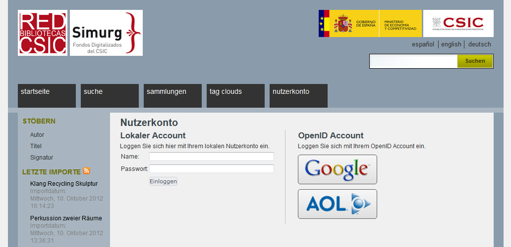

# 2.6.1. OpenID Connect Authentifizierungs-Einstellungen


Das im Goobi viewer 2 verwendete Verfahren OpenID 2.0 ist mittlerweile obsolet.  
Der Goobi viewer 3 verwendet das auf OAuth 2.0 basierende Verfahren OpenID Connect. Die Migration bestehender Benutzerkonten geschieht bei gleichgebliebener E-Mail Adresse automatisch.


Besuchern Ihres Goobi viewers kann das Einloggen gestattet werden, um zusätzliche Rechte zu erhalten. So kann zum Beispiel der Zugriff auf bestimmte kopiergeschützte Inhalte ermöglicht werden. Dabei kann sich der Besucher entweder über ein lokales Nutzerkonto einloggen \(dieses muss von einem Administrator erstellt werden\) oder ein universelles OpenID Connect Konto einer dritten Institution verwenden.



Der Zugriff mittels OpenID Connect wird wie folgt konfiguriert:

```markup
<user>
      <openIdConnect show="true">
            <provider name="Google" endpoint="https://accounts.google.com/o/oauth2/auth" clientId="CHANGEME" clientSecret="CHANGEME" image="google.png" />
            <provider name="Facebook" endpoint="https://www.facebook.com/dialog/oauth" clientId="" clientSecret="" image="facebook.png" />
      </openIdConnect> 
</user>
```

Über das Attribut `show` kann die OpenID Connect Funktionalität komplett ein- bzw. abgeschaltet werden.  
Darüber hinaus können zusätzliche OpenID Connect Provider \(ausstellende Institutionen\) über neue `<provider>` Elemente definiert werden:

| **name** | Angezeigter Provider Name |
| --- | --- | --- | --- | --- | --- |
| **url endpoint** | Authentifizierungs-URL des Providers \(vom jeweiligen Provider zu beziehen - bitte die Anweisungen des Providers beachten\) |
| **useTextField** | Wenn true, wird der Nutzer zunächst aufgefordert, einen Nutzernamen einzugeben \(erforderlich für manche OpenID Provider\) |
| **clientId** | Registrierte ID des Goobi viewers beim jeweiligen Provider. Pro Goobi viewer Installation muss ein neuer Client beim Provider registriert werden. |
| **clientSecret** | Geheimer Schlüssel für die registrierte clientId |
| **image** | Dateiname des angezeigten Provider-spezifischen Bildes |

