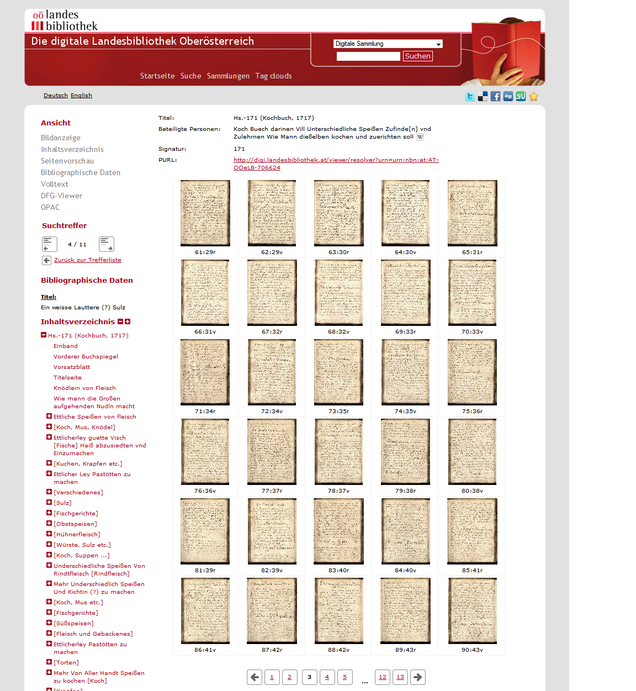

# 2.7.5 Thumbnail Einstellungen

Der Goobi viewer bietet die Möglichkeit, dass sämtliche Seiten eines Werkes in einer Vorschauansicht in Form sogenannter Thumbnails angezeigt werden.



Standardmäßig werden Thumbnail Versionen von Bildern in der Seitenvorschau mit einer Bildgröße von 100x120 Pixel angezeigt. Diese Größe kann mit folgenden Konfigurationselementen geändert werden:

```markup
<viewer>
    <thumbnailsWidth>200</thumbnailsWidth>
    <thumbnailsHeight>240</thumbnailsHeight>
</viewer>
```

Die folgende Option legt die Anzahl von Thumbnails fest, die maximal auf einer Seite der Seitenvorschau angezeigt werden dürfen \(Standard ist 10\):

```markup
<viewer>
    <thumbnailsPerPage>30</thumbnailsPerPage>
</viewer>
```

