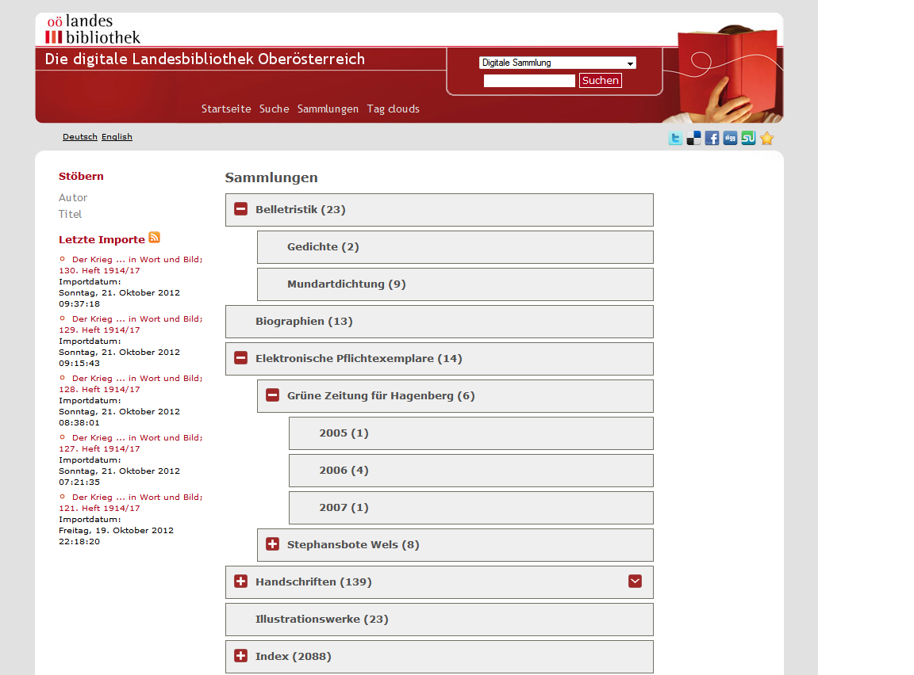

# 2.8.1. Kollektionshierarchie

Eine digitale Kollektion kann mehrere Hierarchiestufen an Subkollektionen enthalten.



Jedes Objekt gehört mindestens einer Kollektion an. Dabei wird diese Information im Index im Feld DC hinterlegt. Die Einträge in diesem Feld bestehen stets aus einem Textstring, der ggf. durch ein Trennzeichen in mehrere Hierarchiestufen für die Kollektion unterteilt ist:

```text
science.mathematics.algebra.algebra1800to1900
```

Die als Trennzeichen interpretierte Zeichenkette \(im obigen Beispiel ein Punkt\) kann über das folgende Konfigurationselement geändert werden:

```markup
<viewer>
     <splittingCharacter>.</splittingCharacter>
</viewer>
```

Dabei ist zu beachten, dass die Namen der einzelnen Hierarchiestufen selbst das Trennzeichen nicht enthalten dürfen, da an diesen Stellen sonst ebenfalls eine Unterteilung stattfindet.

