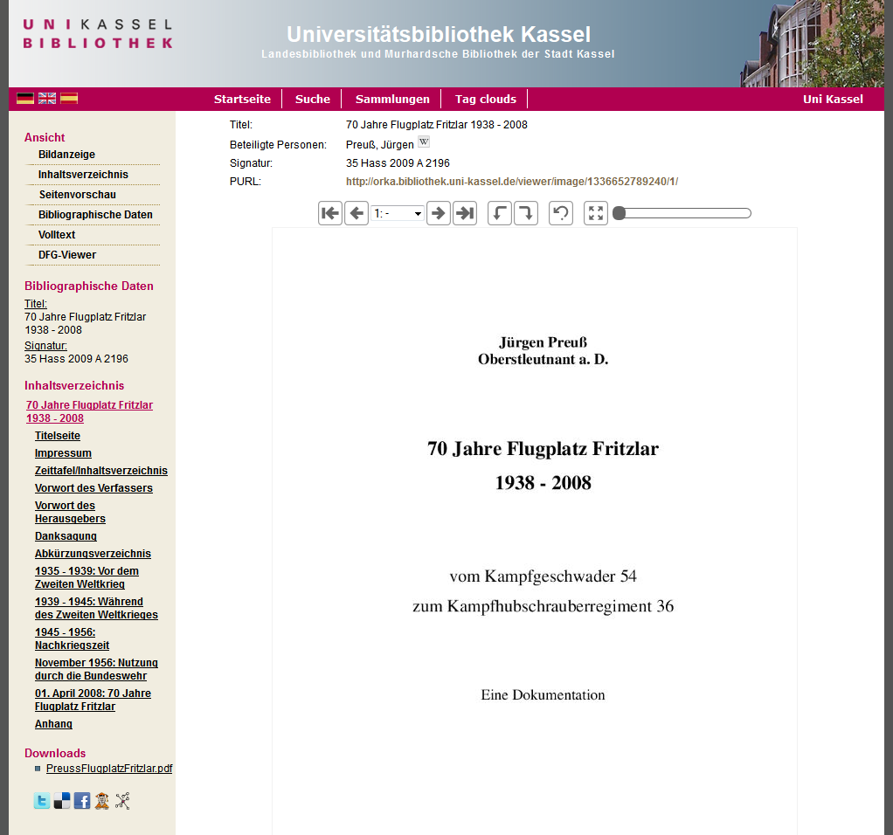

# 2.16. Originalinhalte

Ihr Goobi viewer bietet die Möglichkeit, Dateien zu einem Objekt direkt als Downloads zur Verfügung zu stellen. Dies können z.B. Originalversionen von Born-Digital-Materialien sein.

Dazu muss zunächst der Ordner für Originalinhalte `origContentFolder` konfiguriert werden \(siehe Basiseinstellungen → Ordnerkonfiguration\). Die Dateien werden innerhalb dieses Ordners in Unterordnern abgelegt, die den Identifier des betreffenden Objekts als Ordnername haben \(beispielsweise `/opt/digiverso/viewer/source/PPN123456789/born_digital.pdf`\). Für jede in diesem Unterordner liegende Datei wird ein Download Link in der Objektansicht generiert.



Diese Funktionalität muss in der Konfigurationsdatei zunächst wie folgt aktiviert werden \(Standardwert ist `false`\):  


```markup
<content>
     <originalContentDownload>true</originalContentDownload>
</content>
```

