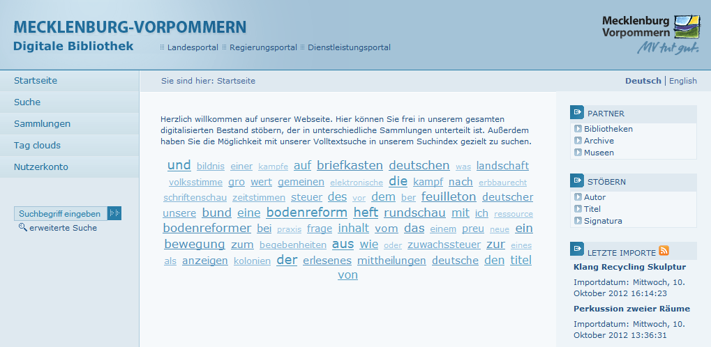

# 2.20 Navigation und Anzeige

Folgende Elemente schalten unterschiedliche Elemente bzw. Funktionen des Viewers an oder ab \(Standardwert ist jeweils `true`\):

```markup
<webGuiDisplay>
    <collectionBrowsing>true</collectionBrowsing>
    <userAccountNavigation>true</userAccountNavigation>
    <displayTagCloudNavigation>true</displayTagCloudNavigation>
    <displayTagCloudStartpage>true</displayTagCloudStartpage>
    <displaySearchResultNavigation>true</displaySearchResultNavigation>
    <displayBreadcrumbs>true</displayBreadcrumbs>
    <displayMetadataPageLinkBlock>true</displayMetadataPageLinkBlock>
    <breadcrumsClipping<50</breadcrumsClipping>
    <disableMenuBrowsingOnSearchList>false</disableMenuBrowsingOnSearchList>
    <displayStatistics>true</displayStatistics>
    <displayTimeMatrix>false</displayTimeMatrix>
    <displayTitlePURL>true</displayTitlePURL>
</webGuiDisplay>
```

| **collectionBrowsing** | Seite mit der Auflistung der Sammlungen |
| --- | --- | --- | --- | --- | --- | --- | --- | --- | --- | --- | --- |
| **userAccountNavigation** | Login Seite für Nutzer |
| **displayTagCloudNavigation** | Link zur Tag Cloud Seite |
| **displayTagCloudStartpage** | Tag Cloud auf der Startseite |
| **displaySearchResultNavigation** | Blätterfunktion zum nächsten/vorherigen Suchtreffer |
| **displayBreadcrumbs** | Breadcrumb Nagivation |
| **displayMetadataPageLinkBlock** | Links auf der Metadaten Seite \(METS/LIDO, MARCXML, DC, OPAC, PDF, ...\) |
| **breadcrumbsClipping** | Maximale Anzahl von Zeichen, die ein Breadcrumb-Eintrag haben kann |
| **disableMenuBrowsingOnSearchList** | Das Stöbern-Menü ausblenden, wenn Suchergebnisee angezeigt werden. Standardwert ist `false`. |
| **displayStatistics** | Link zur Statistikseite. Standardwert ist `true`. |
| **displayTimeMatrix** | Link zur Zeitmatrix \(zweidimensionale Zeitleiste\). Standardwert ist `false`. |
| **displayTitlePURL** | Steht dieses Element auf `false`, wird in der Komponente title.xhtml die PURL zur aktuellen Seite nicht angezeigt, unabhängig von der Einstellung, die die aufrufende Seite übergibt. Standardwert ist `true`. |




