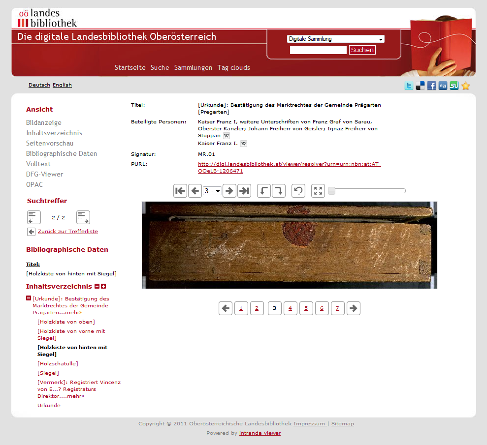

# 2.21 Seitenleiste

Folgende Elemente schalten Links in der Seitenleiste zu den verschiedenen Arten der Objektansicht an bzw. ab \(Standardwert ist jeweils `true`\):

```markup
<sidebar>
     <overview>
           <visible>true</visible>
           <condition>DC:abc</condition>
     </overview>
     <page><visible>true</visible></page>
     <toc>
           <visible>true</visible>
     </toc>
     <thumbs><visible>true</visible></thumbs>
     <metadata>
           <visible>true</visible>
           <showEventMetadata>true</showEventMetadata>
     </metadata>
     <fulltext><visible>true</visible></fulltext>
     <dfg><visible>true</visible></dfg>
     <searchInItem><visible>true</visible></searchInItem>
     <opac><visible>true</visible></opac>
     <sidebarToc>
 
    </sidebarToc>
    <sorting>
           …
    </sorting>
</sidebar>
```

| **overview/visible** | Schaltet die Anzeige von Werks-Übersichtsseiten global ein und aus |
| --- | --- | --- | --- | --- | --- | --- | --- | --- | --- | --- | --- | --- |
| **overview/condition** | Optionale Solr Subquery. Werke, die von dieser Query erfasst werden, bekommen grundsätzlich eine Übersichtsseite angezeigt \(falls overview/visible auf true steht\). Hat das Werk keine eigene Übersichtsseiten-Konfiguration im Index, wird eine Standardkonfiguration verwendet \(es muss sich hierfür eine Default-Konfigurationsdatei mit dem Namen overviewpage.default.xml im lokalen Konfigurationsordner, dessen Pfad unter configFolder eingetragen ist, befinden\). |
| **page** | Bild-/Video-/Audio |
| **toc/visible** | Sichtbarkeit des Links zum Inhaltsverzeichnis in der Werks-Navigation. Achtung: dies ist nicht das Seitenleisten-Inhaltsverzeichnis, hierfür siehe `sidebarToc`. |
| **thumbs/visible** | Seitenvorschau \(Thumbnails\) |
| **metadata/visible** | Metadaten / Bibliographische Daten |
| **metadata/showEventMetadata** | Metadaten aus allen LIDO Events |
| **fulltext/visible** | Volltext |
| **dfg/visible** | Link zum DFG-Viewer |
| **opac/visible** | Link zum OPAC |
| **searchInITem** | Ein Suchschlitz, der eine Suche nach Metadaten und Textstellen im aktuellen Werk bereitstellt. Dieser Suchschlitz wird nur angezeigt, wenn ein Werk geöffnet ist.  |
| **sidebarToc** | siehe 2.12.2. |
| **sorting** | siehe 2.10.4. |



Zusätzlich zur Inhaltsverzeichnis-Seite gibt es ein Inhaltsverzeichnis für die Seitenleiste. Hierfür gelten folgende Konfigurationseinstellungen:

```markup
<sidebar>
     <sidebarToc>
           <visible>true</visible>
           <pageNumbersVisible>false</pageNumbersVisible>
           <lengthBeforeCut>60</lengthBeforeCut>
           <useTreeView>true</useTreeView>
           <initialCollapseLevel>2</initialCollapseLevel>
     </sidebarToc>
</sidebar>
```


| **visible** | schaltet das Seitenleisten Inhaltsverzeichnis ein bzw. ab \(Standardwert ist `true`\) |
| --- | --- | --- | --- | --- |
| **pageNumbersVisible**  | schaltet die Anzeige der Seitenzahlen des Inhaltsverzeichnisses ein bzw. ab \(Standardwert ist false\) |
| **lengthBeforeCut**  | maximale Anzahl der Zeichen eines Elements im Inhaltsverzeichnis, ab der der Text trunkiert wird \(Standardwert ist `10`\) |
| **useTreeView**  | Aktiviert eine aufklappbare Ansicht des Inhaltsverzeichnisses, vergleichbar mit dem Windows Explorer \(Standardwert ist `true`\) |
| **initialCollapseLevel**  | Stufe, bis zu der das Inhaltsverzeichnis beim ersten Öffnen automatisch aufgeklappt werden soll \(mind. 1; Standardwert ist `2`\) |

