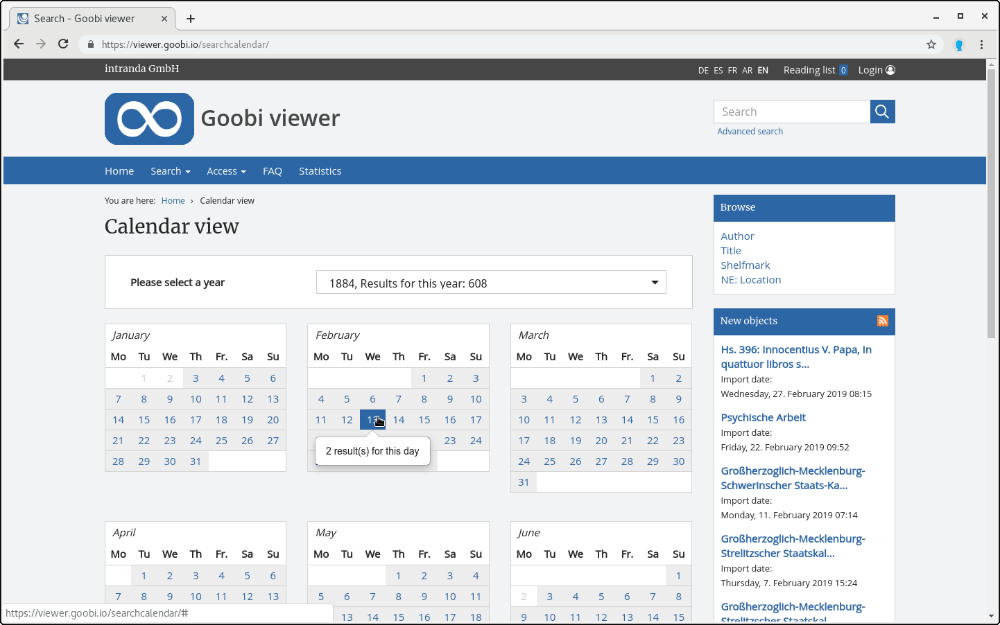

# 2.17.5 Kalender

Es steht ein Kalender zum Sucheinstieg zur Verfügung. Dieser listet alle Werke auf, die das Feld YEARMONTHDAY im Solr Suchindex enthalten.

Der Kalendereinstieg wird mit dem folgenden Schalter aktiviert:



```markup
<search>
    <calendar>
        <enabled>true</enabled>
    </calendar>
</search>
```





