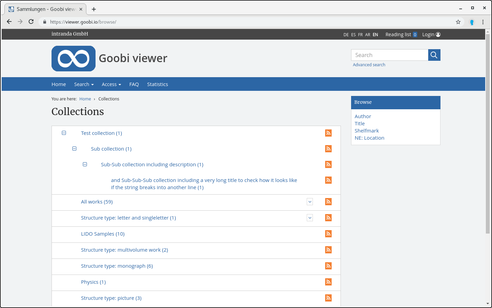

# 2.18.1 Kollektionshierarchie

Eine digitale Kollektion kann mehrere Hierarchiestufen an Subkollektionen enthalten.



Jedes Werk kann einer beliebigen Anzahl von Kollektionen angehören. Auch keine Kollektionszugehörigkeit ist möglich. 

Ist ein Werk mindestens einer Kollektion zugewiesen, so wird diese Information im Index im Feld `DC` hinterlegt. Die Einträge in diesem Feld bestehen stets aus einem Textstring, der gegebenenfalls durch ein Trennzeichen in mehrere Hierarchiestufen für die Kollektion unterteilt ist:


```text
science.mathematics.algebra.algebra1800to1900
```


Die als Trennzeichen interpretierte Zeichenkette \(im obigen Beispiel ein Punkt\) kann für jedes hierarchische Feld individuell über das folgende Konfigurationselement geändert werden:


```markup
<collections>
    <collection field="DC">
        <splittingCharacter>.</splittingCharacter>
    </collection>
</collections>
```


Dabei ist zu beachten, dass die Namen der einzelnen Hierarchiestufen selbst das Trennzeichen nicht enthalten dürfen, da an diesen Stellen sonst ebenfalls eine Unterteilung stattfindet.

Die Übersetzung des oben gegebenen Beispiels für einen intuitiven Sammlungsbaum in den messages Dateien sieht wie folgt aus:


```text
science=Science
science.mathematics=Mathematics
science.mathematics.algebra=Algebra
science.mathematics.algebra.algebra1800to1900=Algebra 1800 to 1900
```


