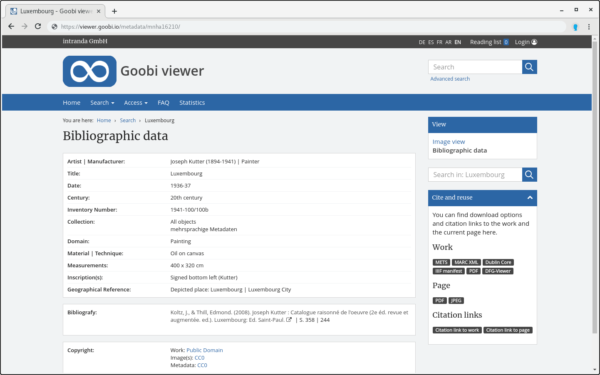

# 2.19.1 Haupt-Metadaten

Die Liste der Haupt-Metadaten \(das heißt Metadaten, die auf der Seite “Bibliographische Daten” angezeigt werden\) können wie folgt konfiguriert werden:



```markup
<metadata>
    <mainMetadataList>
        <template name="_DEFAULT">
            <metadata label="MD_TITLE" value="" type="">
                <param type="field" key="MD_TITLE" />
            </metadata>
            <metadata label="MD_AUTHOR" value="MASTERVALUE_WIKINORM" group="true" type="" >
                <param type="field" key="MD_VALUE" />
                <param type="wikifield" key="MD_VALUE" />
                <param type="normdatauri" key="NORM_URI" />
            </metadata>
            <metadata label="URN " value="" type="">
                <param type="field" key="URN" />
            </metadata>
        </template>
        <template name="monograph">
            <metadata label="MD_TITLE" value="" type="">
                <param type="field" key="MD_TITLE" />
            </metadata>
            <metadata label="MD_AUTHOR" value="MASTERVALUE_WIKINORM" group="true" type="" >
                <param type="field" key="MD_VALUE" />
                <param type="wikifield" key="MD_VALUE" />
                <param type="normdatauri" key="NORM_URI" />
            </metadata>
        </template>
    </mainMetadataList>
</metadata>
```



Hier kann abhängig von dem angezeigten Strukturtyp unterschiedliche Konfigurationen verwendet werden. Die Konfigurationen werden dabei jeweils in einem Element `<template>` platziert. Im obigen Beispiel ist für den Strukturtyp monograph eine eigene Metadatenliste konfiguriert.

Metadaten für LIDO-Events werden ebenfalls über diese Liste konfiguriert. Gewünschte Event-Metadaten müssen hier also ebenfalls aufgelistet sein.

Jedes Element `<metadata>` beschreibt ein Metadatenfeld, das angezeigt werden soll. Die Reihenfolge der Auflistung entspricht dabei der Reihenfolge, in der diese Metadaten \(falls vorhanden\) angezeigt werden. Das Element hat folgende Attribute:

| **Attribut** | Beschreibung |
| :--- | :--- |
| **label** | Der Key für die Bezeichnung dieses Metadatenfeldes \(die Übersetzung für diesen Key muss in der jeweiligen messages.properties vorhanden sein\) |
| **value** | Standardwert des Metadatums. Dieser Wert kann etwa eine URL sein, die in der messages.properties definiert ist und Platzhalter enthält, die durch tatsächliche Werte aus dem Metadatum ersetzt werden \(siehe die Konfiguration von `MD_AUTHOR` im obigen Beispiel\). Für einfache Metadaten sollte dieses Attribut leer gelassen werden \(siehe die Konfiguration von `MD_TITLE` im obigen Beispiel\). |
| **type** | Der Wert des Attributs `type` enthält die Nummer des Reiters oder Blocks, in dem das Metadatum angezeigt werden soll \(beginnend mit 0\). Fehlt dieses Attribut, wird automatisch der Wert 0 verwendet. |
| **group** | Optionales Attribut das angibt, ob es sich um ein gruppiertes Metadatum handelt. Standard ist `false`. |

Titel für die einzelnen Reiter werden in der `messages_*.properties` nach dem Muster `metadataTab<Nummer>` konfiguriert:



```text
metadataTab0=Beschreibung
metadataTab1=Inhalt
metadataTab2=Weitere Informationen
```




Metadaten von Events \(nur aus LIDO-Datensätzen\) werden in der musealen Ansicht als zusätzliche Reiter hinter den regulären Metadaten Reitern dargestellt.




Jedes Element `<metadata>` muss mindestens ein Element `<param>` enthalten. Diese definieren die Quelle der tatsächlichen Werte für diesen Metadatentyp. Folgende Attribute sind dabei zu konfigurieren:

<table>
  <thead>
    <tr>
      <th style="text-align:left"><b>Attribut</b>
      </th>
      <th style="text-align:left">Beschreibung</th>
    </tr>
  </thead>
  <tbody>
    <tr>
      <td style="text-align:left"><b>type</b>
      </td>
      <td style="text-align:left">
        <p>Der Typ des Werts beschreibt die Art, ob und wie der Wert behandelt wird.
          M&#xF6;gliche Typen sind:</p>
        <ul>
          <li><code>field</code>- Der Wert wird so wie er ist &#xFC;bernommen</li>
          <li><code>translatedfield</code>- Der Wert wird in die aktuelle Sprache &#xFC;bersetzt,
            falls eine &#xDC;bersetzung existiert</li>
          <li><code>unescapedfield</code>- es wird kein HTML-Unescaping am Wert vorgenommen</li>
          <li><code>wikifield</code>- Anpassung des Werts f&#xFC;r eine Suchanfrage
            bei Wikipedia: Klammern werden entfernt, Leerzeichen durch Unterstriche
            ersetzt</li>
          <li><code>wikipersonfield</code>- Wie wikifield, aber wenn der Wert ein Komma
            enth&#xE4;lt, werden zus&#xE4;tzlich die Strings vor und nach dem Komma
            vertauscht, so dass Personennamen in das Muster first name_last name f&#xFC;r
            korrektes Wikipedia Resolving &#xFC;berf&#xFC;hrt werden</li>
          <li><code>urlescapedfield</code>- Hierbei werden speziell f&#xFC;r URLs codierte
            Zeichen wie der Slash Unicode-Escaped</li>
          <li><code>normdatauri</code>- Es wird ein Button gerendert, der mithilfe der
            hier enthaltenen Normdaten-URI die Normdaten einholt und &#xF6;ffnet</li>
          <li><code>hierarchicalfield</code> - Erzeugt einen Link f&#xFC;r jedes Hierarchielevel.
            F&#xFC;r die Verwendung mit dem Solr Feld <code>DC</code> gedacht.</li>
        </ul>
      </td>
    </tr>
    <tr>
      <td style="text-align:left"><b>key</b>
      </td>
      <td style="text-align:left">Das Feld im Solr Index, dass den gew&#xFC;nschten Wert enth&#xE4;lt</td>
    </tr>
    <tr>
      <td style="text-align:left"><b>prefix</b>
      </td>
      <td style="text-align:left">Zeichenkette, die unmittelbar vor dem Wert des Metadatums stehen soll
        (Leerzeichen werden mit _SPACE_ kodiert).</td>
    </tr>
    <tr>
      <td style="text-align:left"><b>suffix</b>
      </td>
      <td style="text-align:left">Zeichenkette, die unmittelbar nach dem Wert des Metadatums stehen soll
        (Leerzeichen werden mit _SPACE_kodiert).</td>
    </tr>
    <tr>
      <td style="text-align:left"><b>value</b>
      </td>
      <td style="text-align:left">
        <p>Das Attribut <code>value</code> in <code>&lt;param&gt;</code> bietet optional
          die M&#xF6;glichkeit, f&#xFC;r den jeweiligen Parameter zus&#xE4;tzlich
          ein Master Value (Zeichenkette oder Message Key) zu definieren, in das
          der Wert des Parameters eingesetzt ist (z.B. <code>value=&quot;foo {0} bar&quot;</code>).
          Der Gesamte Ausdruck wird dann in den jeweiligen Platzhalter des Master
          Values des gesamten Metadazums eingesetzt (wenn der Parameter den Index
          0 hat, wird der gesamte Ausdruck in den Platzhalter <code>{0}</code> des
          Metadatums eingesetzt). Ist ein <code>value</code>-Attribut definiert, werden
          evtl. gesetzte <code>prefix</code>- und <code>suffix</code>-Parameter ignoriert.</p>
        <p></p>
        <p>Beispiel:</p>
        <p></p>
        <p><code>&lt;metadata label=&quot;MD_LOREMIPSUM&quot; value=&quot;LOREMIPSUM_MASTER_KEY&quot;&gt;</code>
        </p>
        <p><code>    &lt;param type=&quot;field&quot; key=&quot;MD_LOREM&quot; value=&quot;LOREM_MSG_KEY&quot; /&gt;</code>
        </p>
        <p><code>    &lt;param type=&quot;field&quot; key=&quot;MD_DOLOR&quot; /&gt;</code>
        </p>
        <p><code>&lt;/metadata&gt;</code>
        </p>
        <p></p>
        <p>messages.properties:</p>
        <p><code>MD_LOREMIPSUM=LI</code>
        </p>
        <p><code>LOREMIPSUM_MASTER_KEY={0} ipsum {1} sit amet.</code>
        </p>
        <p><code>LOREM_MSG_KEY=&lt;a href=&quot;https://example.com/?search={0}&gt;{0}&lt;/a&gt;</code>
        </p>
        <p></p>
        <p>Ausgabe:</p>
        <p>LI: <a href="https://example.com/?search=Lorem">Lorem</a> ipsum dolor sit
          amet.</p>
      </td>
    </tr>
  </tbody>
</table>Die Reihenfolge der `<param>` Elemente entspricht der Reihenfolge, in der die Platzhalter im Standardwert \(falls konfiguriert\) ersetzt werden. 

Beispiel:



```text
MASTERVALUE_WIKINORM={1} <a href\="http\://de.wikipedia.org/wiki/{3}" target\="_blank" title\="Wikipedia" alt\="Wikipedia" data-trigger\="hover" data-placement\="top" data-toggle\="tooltip"><i class\="fa fa-wikipedia-w" aria-hidden\="true"></i></a> {5}
```



Der Key `MASTERVALUE_WIKINORM` enthält ein vollständiges HTML Fragment mit einer Wikipedia URL, die wiederum zwei Platzhalter `{1}` und `{3}` enthält. Am Ende wird der Platzhalter für den dann automatisch generierten Link zur GND konfiguriert.

Die Metadaten-Konfiguration für `MD_AUTHOR` \(siehe erstes Beispiel\) enthält drei `<param>` Elemente: ein `field`, ein`wikifield` und ein `normdatauri`. Der unveränderte Wert in field ersetzt dabei `{1}` \(der angezeigte Name\). Derselbe Wert als wikifield wird für Wikipedia Konformität formatiert und ersetzt `{2}` \(Teil der URL\). Das Ergebnis besteht dann aus dem Namen des Autors, gefolgt von einem Wikipedia Icon, das nach folgender URL verlinkt:

```text
http://en.wikipedia.org/wiki/Georges_Grosjean
```


Die Parameter werden mit `{0}`, `{1}`, ... angesprochen. Ist allerdings `group="true"` gesetzt, dann sind es `{1}`, `{3}`, ...


