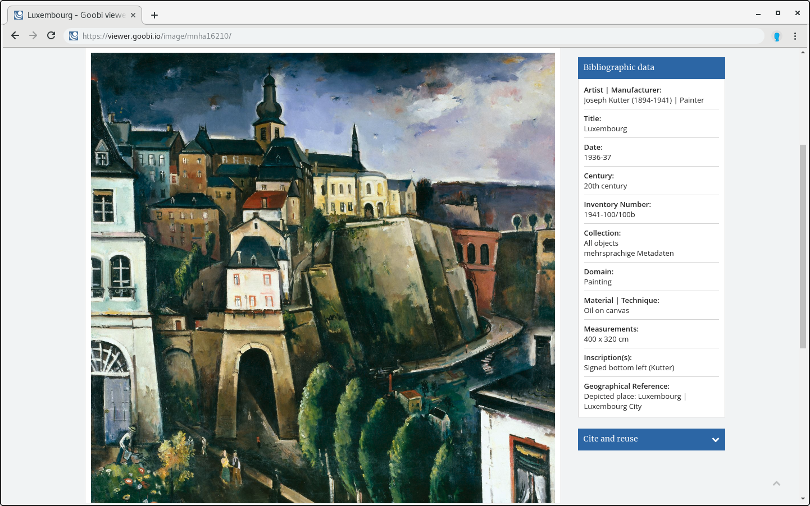

# 2.19.4 Seitenleisten-Metadaten

In der Seitenleiste werden immer nur die Metadaten zum aktuellen Strukturelement angezeigt. Die Konfiguration erfolgt analog zu denen der Haupt-Metadaten:



```markup
<metadata>
    <sideBarMetadataList>
        <template name="_DEFAULT">
            <metadata label="MD_TITLE" value="">
                <param type="field" key="MD_TITLE" />
            </metadata>
            <metadata label="MD_AUTHOR" value="LINK_WIKIPEDIA">
                <param type="field" key="MD_AUTHOR" />
                <param type="wikifield" key="MD_AUTHOR" />
            </metadata>
            <metadata label="MD_SHELFMARK" value="">
                <param type="field" key="MD_SHELFMARK" topstructValueFallback="true" />
            </metadata>
        </template>
        <template name="_GROUPS">
            <metadata label="MD_TITLE" value="">
                <param type="field" key="MD_TITLE" />
            </metadata>
            <metadata label="MD_PUBLISHER" value="">
                <param type="field" key="MD_PUBLISHER" />
            </metadata>
            <metadata label="MD_PLACEPUBLISH" value="">
                <param type="field" key="MD_PLACEPUBLISH" />
            </metadata>
        </template>
        <template name="Map">
            <metadata label="MD_TITLE" value="">
                <param type="field" key="MD_TITLE" />
            </metadata>
            <metadata label="MD_AUTHOR" value="LINK_WIKIPEDIA">
                <param type="field" key="MD_AUTHOR" />
                <param type="wikifield" key="MD_AUTHOR" />
            </metadata>
            <metadata label="MD_COORDINATES" value="">
                <param type="field" key="MD_COORDINATES" />
            </metadata>
        </template>
    </sideBarMetadataList>
</metadata>
```



Die Konfigurationen werden dabei jeweils in einem Element `<template>` platziert. Im obigen Beispiel ist für den Publikationstyp Map eine eigene Metadatenliste konfiguriert, die zusätzlich das Metadatum `MD_COORDINATES` anzeigt. 

Außerdem ist in den `<param />` Einträgen das zusätzliche Attribut `topstructValueFallback="true"` erlaubt. Wenn dieses gesetzt ist, wird das Metadatum des Hauptwerkes angezeigt, auch wenn es im Strukturelement nicht enthalten ist. Ein typisches Anwendungsszenario ist die Anzeige der Signatur bei Handschriften immer in der Seitenleiste präsent zu haben.

Das Template `_GROUPS` wird speziell für die Konfiguration von Seitenleisten-Metadaten von Gruppen \(Bandserien\) verwendet.



