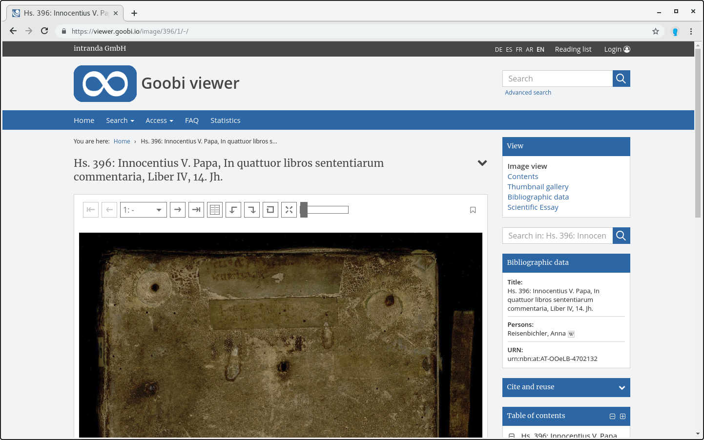

# 2.23 Seitenleiste

Folgende Elemente schalten Links in der Seitenleiste zu den verschiedenen Arten der Werksansicht an beziehungsweise ab \(Standardwert ist jeweils `true`\):



```markup
<sidebar>
    <page>
        <visible>true</visible>
    </page>
    <toc>
        <visible>true</visible>
    </toc>
    <thumbs>
        <visible>true</visible>
    </thumbs>
    <searchInItem>
        <visible>true</visible>
    </searchInItem>
    <metadata>
        <visible>true</visible>
        <showEventMetadata>true</showEventMetadata>
    </metadata>
    <fulltext>
        <visible>true</visible>
    </fulltext>
    <dfg>
        <visible>true</visible>
    </dfg>
    <opac>
        <visible>true</visible>
    </opac>
    <sidebarWidgetUsage display="false">
        <licenseText>
            <metadata label="MD_LICENSETEXT" value="MASTERVALUE_LICENSETEXT">
                <param type="field" key="LABEL" />
                <param type="translatedfield" key="ACCESSCONDITION" />
            </metadata>
        </licenseText>
        <page>
            <displayLinkToJpegImage maxSize="2000">true</displayLinkToJpegImage>
            <displayLinkToMasterImage maxSize="max">true</displayLinkToMasterrImage>
        </page>
    </sidebarWidgetUsage>
</sidebar>
```



| **Option** | Beschreibung |
| :--- | :--- |
| **page/visible** | Bild-/Video-/Audio |
| **toc/visible** | Sichtbarkeit des Links zum Inhaltsverzeichnis in der Werks-Navigation. Achtung: dies ist nicht das Seitenleisten-Inhaltsverzeichnis, hierfür siehe [`sidebarToc`](2.20/2.20.2.md). |
| **thumbs/visible** | Seitenvorschau \(Thumbnails\) |
| **searchInItem/visible** | Suche im Werk |
| **metadata/visible** | Metadaten / Bibliographische Daten |
| **metadata/showEventMetadata** | Metadaten aus allen LIDO Events |
| **fulltext/visible** | Volltext |
| **dfg/visible** | Link zum DFG-Viewer |
| **opac/visible** | Link zum OPAC |
| **sidebarWidgetUsage/@display** | Blendet das Widget ein oder aus. Standardwert ist `false` |
| **sidebarWidgetUsage/licenseText** | Unterhalb von dem Konfigurationselement licenseText kann mit der bekannten Metadatenkonfiguration ein Textblock bestehend aus Text und Metadaten zusammengestellt werden. Für die Syntax siehe auch Kapitel [2.19.1](2.19/2.19.1.md) |
| **sidebarWidgetUsage/page/displayLinkToJpegImage** |  Blendet die Anzeige eines Downloadlinks für das Digitalisat der aktuellen Seite als JPEG ein bzw. aus. Mit dem `maxSize=""` Attribut kann definiert werden wie groß das ausgelieferte Bild wird. Standardwert ist `true`. |
| **sidebarWidgetUsage/page/displayLinkToMasterImage** | Blendet die Anzeige eines Downloadlinks für das Master-Image der aktuellen Seite ein bzw. aus. Mit dem `maxSize=""` Attribut kann definiert werden wie groß das ausgelieferte Bild wird. Standardwert ist `true`. |
|  |  |



Innerhalb dieser Sektion wird in der Konfigurationsdatei auch das Seitenleisten-Inhaltsverzeichnis konfiguriert. Aufgrund der thematischen Nähe, ist es in [Kapitel  2.20.2](2.20/2.20.2.md) beschrieben.

