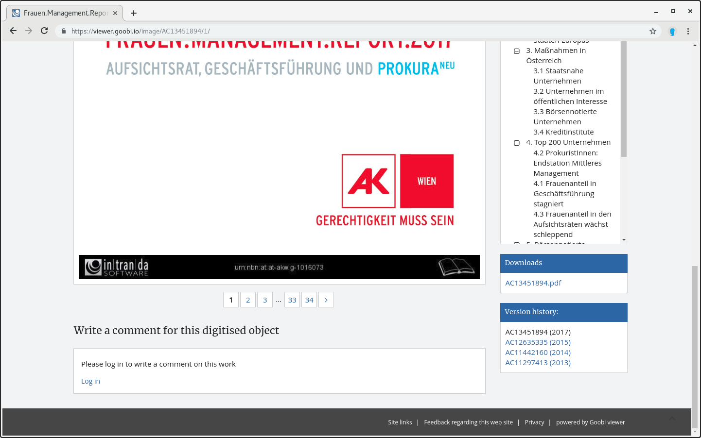

# 2.30 Originalinhalte

Ihr Goobi viewer bietet die Möglichkeit, Dateien zu einem Werk direkt als Download zur Verfügung zu stellen. Dies können zum Beispiel Originalversionen von Born-Digital Dokumenten sein.

Dazu muss zunächst der Ordner für Originalinhalte `origContentFolder` konfiguriert werden \(siehe [Kapitel 2.3 Ordnerkonfiguration](2.3.md)\). Die Dateien werden innerhalb dieses Ordners in Unterordnern abgelegt, die den Identifier des betreffenden Werkes als Ordnername haben \(beispielsweise `/opt/digiverso/viewer/source/PPN123456789/born_digital.pdf`\). Für jede in diesem Unterordner liegende Datei wird ein Download Link in der Werksansicht generiert.



Diese Funktionalität muss in der Konfigurationsdatei zusätzlich mit dem folgenden Schalter aktiviert werden. \(Standardwert ist `false`\):



```markup
<content>
     <originalContentDownload>true</originalContentDownload>
</content>
```




Es ist aktuell nicht möglich aus Goobi workflow oder dem Goobi viewer heraus die Dokumente auch wieder zu löschen. Das geht nur manuell direkt im Dateisystem.


