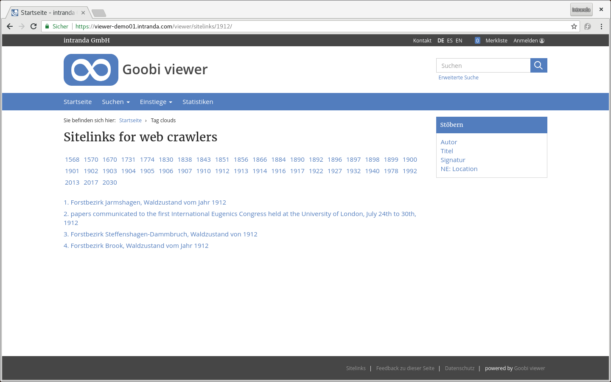

# 2.32 Sitelinks

Für Suchmaschinen kann zum Beispiel eine Übersicht der nach Jahren exportierten Werke generiert werden. Die Konfiguration dafür erfolgt in dem Element `<sitemap>`



```markup
<sitemap>
    <sitelinksField>YEAR</sitelinksField>
    <sitelinksFilterQuery>ISWORK:true</sitelinksFilterQuery>
</sitemap>
```



Die Sitelinks sind unter der folgenden Adresse abrufbar:

```text
https://viewer.example.org/viewer/sitelinks/
```




