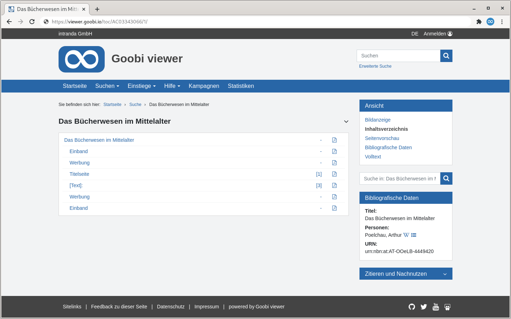

# 2.9 PDF Download

Für das gesamte Werk wie auch für einzelne Strukturelemente oder Bilder können PDF-Dateien generiert werden. Die Optionen stehen im Widget "Zitieren und Nachnutzen" oder teilweise in der Inhaltsverzeichnis Ansicht zur Verfügung.

