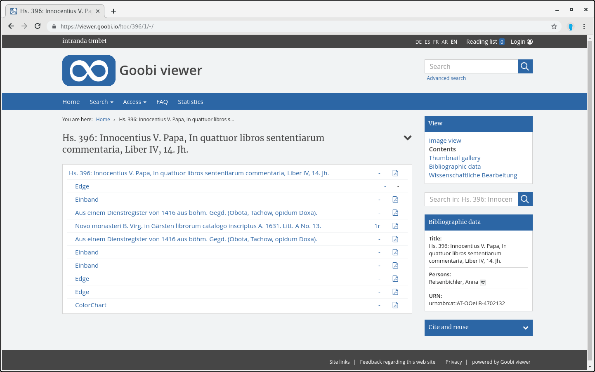

# 2.9 PDF Download

Die PDF-Download Links starten die Generierung eines PDFs des gesamten aktuellen Werkes oder eines bestimmten Strukturelementes. Letzteres ist nur aus der Inhaltsverzeichnis-Ansicht eines Werkes möglich.  
Jedem Inhaltsverzeichniseintrag kann ein Link zum Generieren des entsprechenden PDFs hinzugefügt werden.

