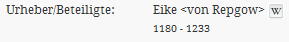

# 3.5 Weitere Optionen

Im Folgenden werden einige weitere Parameter für die Indizierung erläutert.

**3.5.1. Parameter: addSortField**

```text
Werte: true|false
```

Falls `true`, wird zusätzlich zum konfigurierten Metadatenfeld ein zweites Feld geschrieben, das für die Sortierung von Suchtreffern verwendet werden kann. Dabei erhält das zweite Feld den Präfix SORT\_ im Namen. Dies ist insbesondere bei Feldern nützlich, deren Name mit dem Präfix MD\_ anfängt \(MD\_ wird dabei durch `SORT_` ersetzt\). Diese sind im Solr Schema stets so konfiguriert, dass sie mehrere Werte als Liste enthalten können - solche Felder können in Solr nicht für die Sortierung verwendet werden. Zu beachten ist, dass ein Sortierfeld nicht alle gefundenen Werte enthält, sondern nur den ersten \(zum Beispiel den ersten Autor eines Werks\). Standardwert ist `false`.

**3.5.2. Parameter: addToDefault**

```text
Werte: true|false
```

Metadatenfelder mit Präfix `MD_` werden stets in einzelne Tokens \(grob gesehen einzelne Wörter einer Zeichenkette\) aufgespalten. Damit man ein Feld durchstöbern kann \(siehe Stöbern\), muss die gesamte Zeichenkette als ein Token vorliegen \(andernfalls kann man zum Beispiel keine Haupttitel, sondern nur einzelne Wörter aus Haupttiteln durchstöbern\). Hierfür kann zusätzlich zum Metadatenfeld eine Kopie angelegt werden, deren Wert als ein Token vorliegt \(diese erhält den Suffix `_UNTOKENIZED`\). Solche Felder können für die Stöbern-Funktion konfiguriert werden. Standardwert ist `true`.

**3.5.3. Parameter: addUntokenizedVersion**

```text
Werte: true|false
```

Metadatenfelder mit Präfix MD\_ werden stets in einzelne Tokens \(grob gesehen einzelne Wörter einer Zeichenkette\) aufgespalten. Damit man ein Feld durchstöbern kann \(siehe Stöbern\), muss die gesamte Zeichenkette als ein Token vorliegen \(andernfalls kann man zum Beispiel keine Haupttitel, sondern nur einzelne Wörter aus Haupttiteln durchstöbern\). Hierfür kann zusätzlich zum Metadatenfeld eine Kopie angelegt werden, deren Wert als ein Token vorliegt \(diese erhält den Suffix `_UNTOKENIZED`\). Solche Felder können für die Stöbern-Funktion konfiguriert werden. Standardwert ist `true`.

## **3.5.4. Parameter:Parameter: groupEntity**

Personen und Körperschaften können u.U. zusätzliche Metadaten enthalten, wie etwa Lebensdaten beziehungsweise externe Links. Diese Metadaten möchte man evtl. gruppiert anzeigen, um die Zusammengehörigkeit deutlich zu machen:



Hierfür gibt es eine Möglichkeit, zusammengehörende Metadaten, etwa von Personen und Körperschaften, in ein separates Solr Index-Dokument zu schreiben. Diese können dann seitens des Goobi viewers geparst und grafisch entsprechend aufbereitet werden.

Wenn dieses Konfigurationselement auf `true` gesetzt wird, wird für das betreffende Metadatenfeld die folgende MODS Struktur vorausgesetzt:

```markup
<mods:name type="personal" xlink:href=http://de.wikipedia.org/wiki/Eike_von_Repgow  valueURI="http://d-nb.info/gnd/118529501">

      <mods:namePart type=”family”>&lt;von Repgow&gt;</mods:namePart>
      <mods:namePart type=”given”>Eike</mods:namePart>
      <mods:namePart type="date">1180 - 1233</mods:namePart>

      <mods:role>
            <mods:roleTerm authority="marcrelator" type="code">aut</mods:roleTerm>
      </mods:role>

      <mods:displayForm>&lt;von Repgow&gt;, Eike</mods:displayForm>
</mods:name>
```

Die Konfiguration erfolgt im Konfigurationselement &lt;groupEntity&gt;. Dieses kann optional das Attribut type enthalten \(zulässige Werte: `PERSON`, `CORPORATION`, `LOCATION`, `SUBJECT`, `ORIGININFO`, `OTHER`\) das im Goobi viewer unter bestimmten Umständen eine spezielle Behandlung des Metadatums auslösen kann \(zum Beispiel die Anzeige eines Personen-Icons bei Suchtreffern, deren ein Personen-Metadatum zugrunde liegt\).

```markup
<MD_AUTHOR>
    <list>
        <item>
            <xpath>
                <list>
                    <item>mets:xmlData/mods:mods/mods:name[@type="personal"][mods:role/mods:roleTerm="aut"[@authority='marcrelator'][@type='code']]</item>
                </list>
            </xpath>
            <groupEntity type="PERSON">
                <field name="MD_VALUE">mods:displayForm</field>
                <field name="MD_DISPLAYFORM">mods:displayForm</field>
                <field name="MD_LINK">@xlink:href</field>
                <field name="MD_CORPORATION">mods:namePart[not(@type)]</field>
                <field name="MD_LASTNAME">mods:namePart[@type="family"]</field>
                <field name="MD_FIRSTNAME">mods:namePart[@type="given"]</field>
                <field name="MD_LIFEPERIOD">mods:namePart[@type="date"]</field>
                <field name="NORM_URI">@valueURI</field>
            </groupEntity>
        </item>
    </list>
</MD_AUTHOR>
```

Die einzelnen Metadatenfelder innerhalb des Index-Dokuments werden in `<field>`-Elementen konfiguriert. Das Attribut name beschreibt den gewpnschten Namen des Indexfelds innerhalb des Dokuments, der Textwert des `<field>`-Elements beinhaltet den XPath-Ausdruck des jeweiligen Metadatums.

Die XPath Ausdrücke werden dabei relativ zum Element definiert, das durch den jeweiligen XPath-Ausdruck in einem `<item>`-Element gefunden wird. Im obigen Beispiel verstehen sich die XPath Ausdrücke in &lt;field&gt;-Elementen relativ zu `<mods:name>`.


Es sind beliebige Links möglich. Die Darstellungsart mit dem Wikipedia Symbol im obigen Beispiel wurde in messages.properties konfiguriert \(siehe Metadaten Konfiguration\). Aus technischen Gründen kann jedoch nur eine Darstellungsart pro Solr Feld konfiguriert werden.



Das Unterfeld MD\_VALUE enthält den „Hauptwert“ des Metadatums \(Etwa den Namen von Personen, Körperschaften und Schlagwörtern. Es ist zwingend erforderlich, damit das gruppierte Metadatum auch in den Index übernommen wird.


Fehlt das Konfigurationselement, wird eine einfache Zeichenkette mit dem Namen der Person beziehungsweise Körperschaft in `mods:displayForm` erwartet.

## 3.5.5. Parameter: getnode

```text
Werte: first
```

Ist der Wert auf `first` gesetzt, wird nach dem ersten gefundenen Wert für den aktuellen XPath Ausdruck abgebrochen. Zu beachten ist, dass für ein Solr Feld mehrere XPath-Ausdrücke definiert werden können, für die ebenfalls Werte existieren können.

## 3.5.6. Parameter: getchildren {#H3.5.6.Parameter:getchildren}

```text
Werte: all
```

Ist der Wert auf `all` gesetzt, werden Werte für dieses Metadatum von allen unmittelbar untergeordneten Strukturelementen mit übernommen.

## 3.5.7. Parameter: getparents {#H3.5.7.Parameter:getparents}

```text
Werte: first|all
```

Ist der Wert auf `first` gesetzt, werden Werte für dieses Metadatum auch vom unmittelbar übergeordneten Strukturelement mit übernommen. Bei `all` werden Werte für dieses Metadatum aus allen übergeordneten Strukturelementen bis hin zum obersten übernommen.

## 3.5.8. Parameter: lowercase {#H3.5.8.Parameter:lowercase}

```text
Werte: true|false
```

Ist diese Option auf `true` gesetzt, werden alle Großbuchtstaben in der Zeichenkette durch Kleinbuchstaben ersetzt. Standardwert ist `false`.

Beispiel:

```text
“Buch Druck” ==> “buch druck”
```

## 3.5.9. Parameter: onefield {#H3.5.9.Parameter:onefield}

```text
Werte: true|false
```

Falls `true`, werden alle gefundenen Werte in das Solr Feld als eine Zeichenkette geschrieben. Die Werte werden dabei durch die Zeichenkette `“; “` separiert. Bei `false` wird für jeden Wert eine neue Zeichenkette geschrieben. Im letzteren Fall muss das betreffende Feld im Solr Schema so konfiguriert sein, dass Listen aus mehreren Werten erlaubt sind. Standardwert ist `false`.

## 3.5.10. Parameter: onetoken / splittingCharacter {#H3.5.10.Parameter:onetoken2FsplittingCharacter}

```text
Werte (onetoken): true|false
Werte (splittingCharacter): beliebige Zeichenkette
```

Wenn das Konfigurationselement `onetoken` auf `true` gesetzt ist, werden die Werte so aufgearbeitet, dass Solr diese nicht in mehrere Tokens aufteilen kann. Konkret bedeutet das, dass nicht alphanumerische Zeichen entfernt werden. Standardwert ist `false`.

Beispiel:

```text
"Buch Druck, Hallo Welt" ==> "BuchDruckHalloWelt"
```

Ist für dieses Feld zusätzlich eine beliebige Zeichenkette im Element splittingCharacter konfiguriert, werden alle Vorkommnisse dieser Zeichenkette durch einen Punkt \(.\) ersetzt.

Beispiel:

```text
<splittingCharacter>#<splittingCharacter>
"Buch#Druck, Hallo Welt"==> "Buch.DruckHalloWelt"
```


Diese Konfigurationselemente existieren speziell für die Behandlung von Kollektionsnamen im Goobi viewer \(Feld DC\) und bringen keinen Mehrwert bei anderen Metadatenfeldern.


## 3.5.11. Parameter: normalizeYear {#H3.5.11.Parameter:normalizeYear}

```text
Werte: true|false
```

Dieses Konfigurationselement ist für Metadatenfelder bestimmt, die Datumsangaben beziehungsweise Jahreszahlen enthalten. Wird dieses Element auf ‘`true`’ gesetzt, versucht der Goobi viewer Indexer, aus dem Wert dieses Feldes eine normalisierte Jahreszahl \(nach dem Muster `yyyy`\) zu extrahieren. Zur Zeit werden reine Jahreszahlen sowie Datumsangaben nach den Mustern `dd.MM.yyyy` und `yyyy-MM-dd` erkannt. Alle erkannten Jahreszahlen werden in das Feld `YEAR` geschrieben. Zusätzlich wird aus diesen Jahreszahlen noch das jeweilige Jahrhundert berechnet und in das Feld `CENTURY` geschrieben.

Ab Goobi viewer 2.3: Es werden zusätzlich die Felder `YEARMONTH` und `YEARMONTHDAY` aus den erkannten Datumsangaben erzeugt. Diese sind u.a. für die Jahressuche und den Kalendereinstieg notwendig \(siehe 2.10.2\).

Beide Felder können zum Beispiel für die Facettierung von Suchtreffern verwendet werden. Da es sich um Felder mit mehreren möglichen Werten pro Feld handelt, können sie allerdings nicht für die Suchtreffersortierung verwendet werden. Standardwert ist `false`.

Optional kann das Attribut `<normalizeYear minYearDigits=“n“>` konfiguriert werden. Der Wert `n` gibt dabei an, ab wie vielen Ziffern frei stehende Zahlen in einer Zeichenkette als Jahreszahlen interpretiert werden sollen. Mindestwert ist 1. Standardwert ist `3`.

## 3.5.12. Parameter: replace {#H3.5.12.Parameter:replace}

Dieses Konfigurationselement ersetzt einzelne ASCII Zeichen beziehungsweise Zeichenketten durch eine andere Zeichenkette. Ein zu ersetztes Zeichen wird im Attribut `char` als ASCII Zahlencode angegeben. Alternativ kann im Attribut `string` eine Zeichenkette angegeben werden. Die Zeichenkette, die stattdessen geschrieben werden soll, wird innerhalb des Elements angegeben.

Beispiel 1:

```markup
<replace char="10">&lt;br /&gt;</replace>
```

Im obigen Beispiel wird ein ASCII Zeichen für den Zeilenumbruch `(10)` durch die HTML Zeichenkette für den Zeilenumbruch ersetzt.

Beispiel 2:

```markup
<replace string="¬"></replace>
```

In diesem Beispiel wird das Nichtsortierzeichen ‘¬’ durch nichts ersetzt \(das heißt entfernt\).

## 3.5.13. Parameter: nonSortCharacters {#H3.5.13.Parameter:nonSortCharacters}

Alternativ zum Ersetzen von Nichtsortierzeichen \(siehe 3.5.12\) kann mit diesem Konfigurationselement die Erkennung von Nichtsortier-Teilen für Metadaten- sowie Sortierfelder konfiguriert werden. Dabei werden für angezeigte Metadatenfelder die Nichtsortierzeichen herausgefiltert, für Sortierfelder wird der gesamte Teil der Zeichenkette, der durch die Nichtsortierzeichen diskriminiert ist, entfernt.

Ist der für die Sortierung des nicht relevanten Teils beidseitig von Nichtsortierzeichen umschlossen, zum Beispiel `“«“` und `“»“,` muss `“«“` im Attribut prefix, `“»“` im Attribut s`u`ffix konfiguriert werden.

Beispiel 1:  
METS:

```text
<mods:name>
     ...
     <mods:displayForm><<von>> Goethe, Johann Wolfgang</mods:displayForm>
<mods:name>

solr_indexerconfig.xml:
<nonSortCharacters prefix="&lt;&lt;" suffix="&gt;&gt;" />
```

Ergebnis

```text
<MD_TITLE>von Goethe, Johann Wolfgang</MD_TITLE>
<SORT_TITLE>Goethe, Johann Wolfgang<MD_TITLE>
```

Wird der nicht für die Sortierung relevante Teil nur auf einer Seite vom Rest der Zeichenkette getrennt, muss dieses Zeichen nur als `prefix` \(nicht relevanter Teil am Anfang der Zeichenkette\) beziehungsweise `suffix` \(nicht relevanter Teil am Ende der Zeichenkette\) konfiguriert werden.

Beispiel 2:  
METS:

```text
<mods:name>
     ...
     <mods:displayForm>von¬ Goethe, Johann Wolfgang</mods:displayForm>
<mods:name>
```

solr\_indexerconfig.xml:

```markup
<nonSortCharacters suffix="\u00AC" />
```

Ergebnis:

```text
<MD_TITLE>von Goethe, Johann Wolfgang</MD_TITLE>
<SORT_TITLE>Goethe, Johann Wolfgang<MD_TITLE>
```

## 3.5.14. Parameter: addToChildren {#H3.5.14.Parameter:addToChildren}

Ist diese Parameter auf `true` gesetzt, werden die Werte dieses Metadatums an untergeordnete Strukturtyp-Dokumente vererbt. Dies ist zum Beispiel für Lizenztypen wichtig, die eine Solr-Bedingungsquery verwenden. Die in der Query verwendeten Feldnamen müssen in der Regel diesen Parameter aktiviert haben. Das Feld DC muss diesen Parameter immer aktiviert haben. Standardwert ist `false`.

## 3.6.15. Parameter: addToPages {#H3.6.15.Parameter:addToPages}

Ist diese Parameter auf `true` gesetzt, werden die Werte dieses Metadatums an die der jeweiligen Strukturhierarchie zugewiesene Seitendokumenten vererbt. Dies ist zum Beispiel für Lizenztypen wichtig, die eine Solr-Bedingungsquery verwenden. Die in der Query verwendeten Feldnamen müssen in der Regel diesen Parameter aktiviert haben. Und auch Metadatenfelder, die in der erweiterten Suche mit Volltexten kombiniert werden sollen. in den SeitendokumentenDas Feld DC muss diesen Parameter immer aktiviert haben. Standardwert ist `false`.

