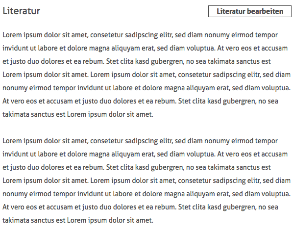
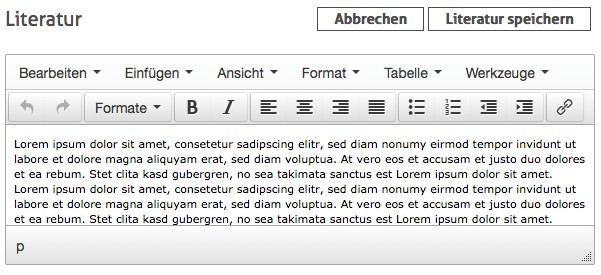

# 5.2.2 Literaturangaben

Ist ein Nutzer mit administrativen Rechten angemeldet, kann er das zu bearbeitende Werk mit einer Literaturangabe versehen. Hierzu klickt er auf die Schaltfläche `Literatur` bearbeiten.    

Anschließend wird ein Texteditor angezeigt, der es ermöglicht die Literaturangaben zu verfassen. Hierfür stehen dem Nutzer alle innerhalb von HTML erlaubten Arten der Textformatierung zur Verfügung. Für eine komfortablere Bearbeitung der Literaturangabe existiert in diesem Texteditor ebenfalls ein Vollbildmodus. Diesen erreicht man über das Menü des Editors mittels Klick auf `Ansicht` und anschliessend auf `Vollbid`. Den Vollbildmodus kann man auf dieselbe Weise später wieder verlassen.

Sobald alle Änderungen an der Literaturangabe abgeschlossen sind, wird das Ergebnis gespeichert, indem auf die Schaltfläche `Literatur speichern` geklickt wird.  

