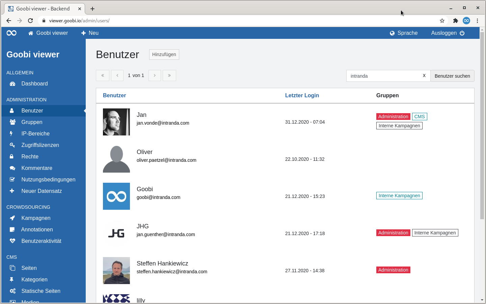
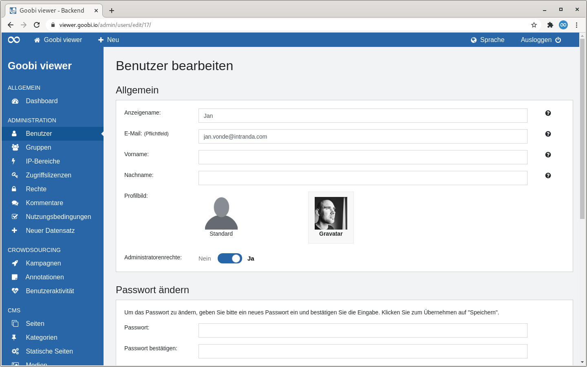
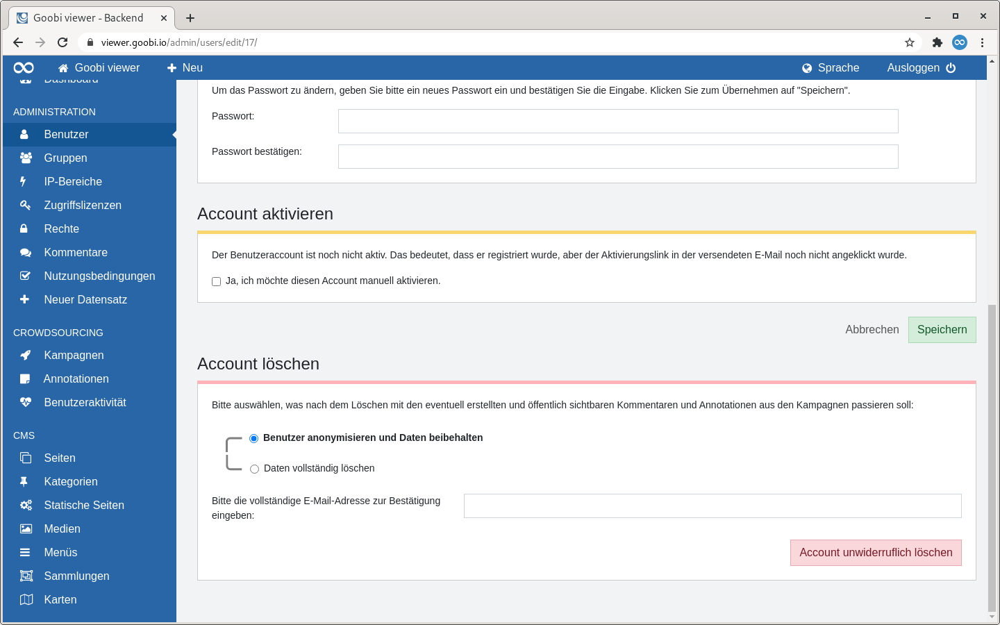

# 5.2.1 Benutzer

## Übersicht

Die Seite "Benutzer" listet alle registrierten Benutzeraccounts in tabellarischer Form auf. 

Rechts neben der Seitenüberschrift befindet sich ein Button um manuell einen neuen Benutzeraccount anzulegen.

Oberhalb der Tabelle befindet sich zwei Bereiche:

* **Links**: Ein Paginator. In der Tabelle werden maximal 15 Einträge angezeigt. Enthält ein Trefferset mehr als diese 15 Einträge, kann dort in den Treffern navigiert werden.
* **Rechts**: Ein Suchschlitz. Gesucht wird im Anzeigenamen, in der E-Mailadresse und in den zugewiesenen Gruppen.

Wird die Überschrift einer Spalte als Link dargestellt besteht die Möglichkeit nach dieser Spalte zu sortieren. Fährt man mit der Maus über eine Überschrift zeigt einem ein kleiner Pfeil an wie sortiert werden würde wenn man klickt. Nach der Sortierung wird dieser Pfeil dauerhaft angezeigt.

Die Tabelle zeigt in der ersten Spalte das vom Benutzer gewählte Profilbild und dessen E-Mail-Adresse. Sofern der Benutzer einen Anzeigenamen eingegeben hat wird dieser dort ebenfalls angezeigt. Die zweite Spalte zeigt an wann sich der Account das letzte Mal angemeldet hat. In der dritten Spalte ist sichtbar ob ein Benutzer Mitglied einer Gruppe ist oder Administratorenrechte besitzt. Dabei folgen die Farben der Badges dem folgenden Schema:

* **Schwarz**: Der Nutzer ist Mitglied in der angegebenen Gruppen
* **Hellblau** : Der Nutzer ist Eigentümer der Gruppe
* **Rot**: Der Nutzer hat Administratorenrechte

Fährt man mit der Maus über eine Tabellenzeile wird in der ersten Spalte ein Link zum Bearbeiten des Benutzeraccounts sichtbar.

## Bearbeiten

Wird ein Benutzeraccount bearbeitet gliedert sich die Seite in die vier potentiellen Abschnitte: "Allgemein", "Passwort ändern", "Account aktivieren" und "Account löschen" auf.

### Allgemein

Die E-Mail-Adresse ist das einzige Pflichtfeld. Bei dem Profilbild kann zwischen einem Standardbild oder dem Dienst "Gravatar" gewählt werden. Wenn der Benutzeraccount Administratorenrechte bekommen soll muss der Schalter an dieser Stelle umgelegt werden. Für alle Felder steht eine Inline-Hilfe zur Verfügung.

### Passwort ändern

Um das Passwort für einen Benutzeraccount zu ändern kann hier zweimal ein neues eingegeben werden. 

### Account aktivieren

Wenn ein Benutzeraccount registriert aber noch nicht aktiviert ist, das bedeutet, dass zum Beispiel der Aktivierungslink aus der E-Mail noch nicht angeklickt wurde, kann die Aktivierung an dieser Stelle manuell vorgenommen werden.

Diese Sektion wird nur bei nicht aktiven Benutzeraccounts angezeigt.

### Account löschen

In diesem Abschnitt kann ein Administrator einen Benutzeraccount löschen. Dabei steht zur Auswahl die potentiell vom Benutzer erstellte Kommentare, Crowdsourcing Inhalte und Annotationen zu anonymisieren, oder komplett zu entfernen. Ausgenommen sind OCR Korrekturen.

Bei der Anonymisierung werden die Daten der Sammel E-Mailadresse `anonymous@goobi.io` zugewiesen. Wenn eine andere Adresse gewünscht wird, kann diese in der lokalen Konfigurationsdatei gesetzt werden. Siehe dazu auch [Kapitel 2.5.3](https://docs.goobi.io/goobi-viewer-de/2/2.5/2.5.3) in der Dokumentation.

