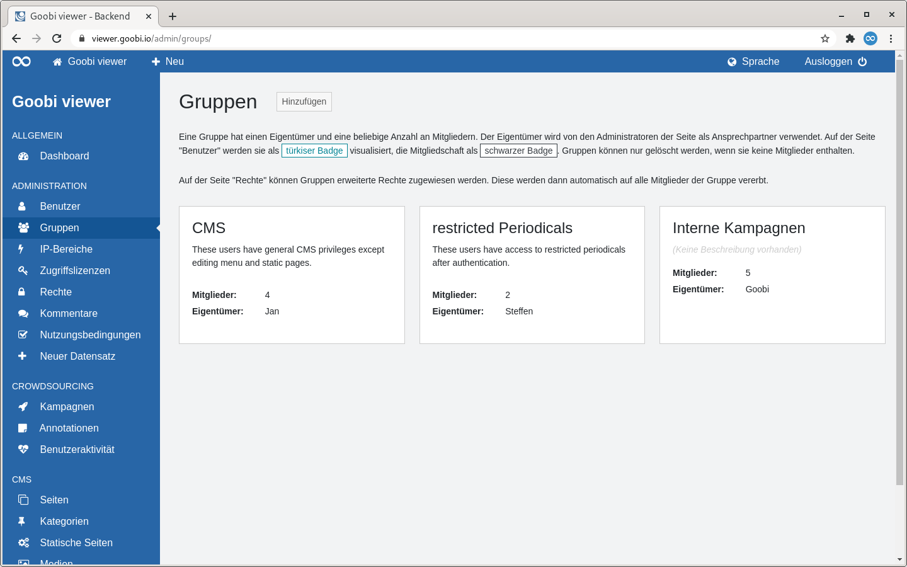
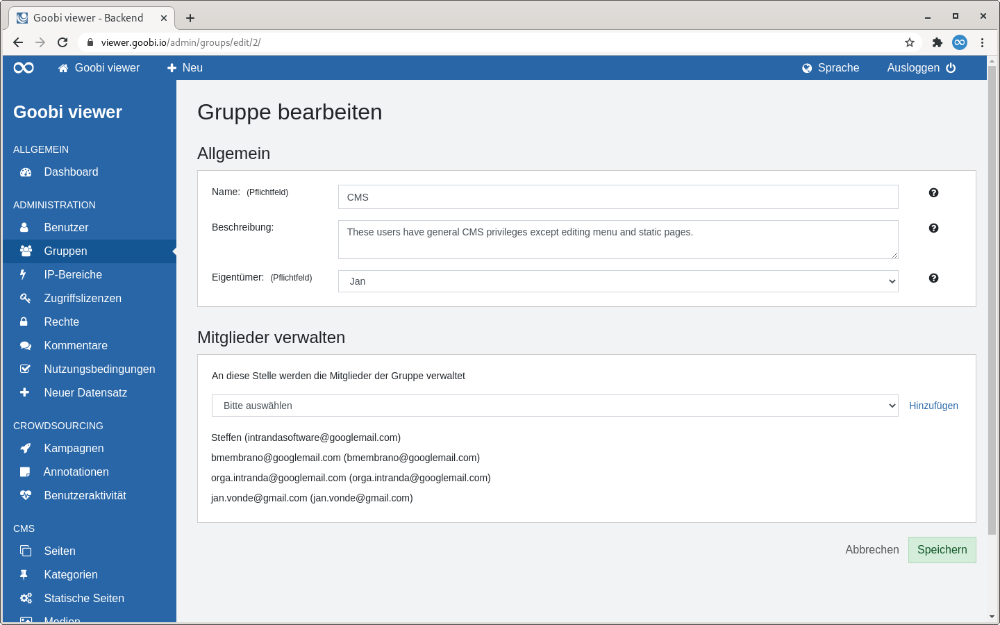

# 5.2.2.2 Gruppen

## Allgemein

Gruppen haben einen Eigentümer und eine beliebige Anzahl an Mitgliedern. Der Eigentümer wird von den Administratoren der Seite als Ansprechpartner verwendet. Auf der Seite [Rechte](5.2.2.5.md) können Gruppen erweiterte Rechte zugewiesen werden. Diese werden automatisch auf alle Mitglieder der Gruppe vererbt.

## Übersicht

Die Seite "Gruppen" listet alle angelegten Benutzergruppen als Kacheln auf.

Rechts neben der Seitenüberschrift befindet sich ein Button um eine neue Benutzergruppe hinzuzufügen.

Anschließend folgt ein beschreibender Text zu den Farben der Gruppenbadges auf der Seite "Benutzer" sowie ein Hinweis auf die Möglichkeit Gruppen auf der Seite "Rechte" weitere Rechte zuzuweisen.

Darunter werden die verfügbaren Benutzergruppen in einer Kachelansicht dargestellt. Eine Kachel enthält den Namen der Gruppe als Überschrift sowie darunter optional eine Beschreibung. Außerdem ist sichtbar wie viele Mitglieder eine Gruppe enthält und wer dessen Eigentümer ist.

Fährt man mit der Maus über eine Kachel wird ein Link zum Bearbeiten oder Löschen der Benutzergruppe sichtbar.


Das Löschen einer Benutzergruppe ist nur möglich, wenn sie keine Mitglieder mehr enthält und der Gruppe keine Rechte zugewiesen sind. 


## Hinzugefügen

Wird eine Benutzergruppe hinzugefügt sind zwei Abschnitte sichtbar: "Allgemein" und "Mitglieder verwalten".

### Allgemein

Der Name einer Gruppe ist ein Pflichtfeld. Die optionale Beschreibung hilft den Sinn und Zwecke der Benutzergruppe festzuhalten. Sie ist nur für Administratoren sichtbar. Der verpflichtende Eigentümer dient Administratoren als Ansprechpartner.


Wird eine Crowdsourcing Kampagne auf eine Benutzergruppe eingeschränkt ist der Eigentümer einer Gruppe gleichzeitig Eigentümer der Kampagne.


### Mitglieder verwalten

Hier können neue Mitglieder zur Gruppe hinzugefügt oder bestehende wieder entfernt werden.

