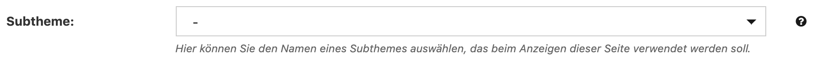
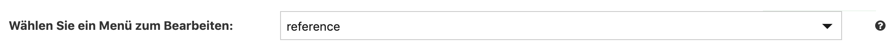

# 5.2.2.4 Subthemes

### Was sind Subthemes?

Subthemes sind eine Möglichkeit Bereiche des Goobi viewers in einem anderen Design zu gestalten. 

### Wie kann ich Subthemes verwenden?

Als Beispiel für eine Anwendung von Subthemes sei der viewer der Arbeiterkammer Wien \([https://emedien.arbeiterkammer.at/viewer/](https://emedien.arbeiterkammer.at/viewer/)\) erwähnt. Hier werden die unterschiedlichen Institutionen mittels Subthemes dargestellt. Jede Institution hat eigene Seiten und ein separates Logo. Die Seiten und deren Inhalte können über das Content Management System \(CMS\) des Goobi viewers erstellt werden.

## CMS

### Subtheme einer CMS-Seite zuweisen

Wenn Sie einer CMS-Seite ein Subtheme zuweisen möchten, dann wählen Sie aus dem Menü **Subtheme** _****_die entsprechende Bezeichnung aus und speichern die Seite anschließend ab.   
Die Seite ist nun dem gewählten Subtheme zugewiesen und es gelten alle dafür erstellten Komponenten, wie zum Beispiel das Menü oder ein individueller Stylesheet.



Wie Sie eine CMS-Seite erstellen, können Sie im [Kapitel 5.1.2](./) nachlesen.

### Menü für ein Subtheme anlegen

Sie können pro Theme und Subtheme ein Menü anlegen und mit unterschiedlichen Verlinkungen versehen. Zum erstellen oder bearbeiten eines Menüs klicken Sie auf den Bereich **Menüs**.

Als Standard-Menü ist das des Haupt-Themes ausgewählt. Wenn Sie ein Menü für ein Subtheme anlegen oder bearbeiten möchten, dann klicken Sie auf das Auswahlmenü **Wählen Sie ein Menü zum Bearbeiten** und suchen das entsprechende Subtheme aus.



Wie Sie ein Menü anlegen, können Sie im [Kapitel 5.1.3](../5.2.6.md) nachlesen.


**TIPP:** Wenn Sie für jedes Subtheme eine Kategorie im Goobi viewer Backend anlegen und den CMS-Seiten zuweisen, dann ist es leichter in der Seitenübersicht nach Subthemes zu filtern.

Wie Sie Kategorien anlegen, können Sie im [Kapitel 5.1.6](../5.2.3.md) nachlesen.


## Konfiguration

### config\_viewer.xml

Um die Funktionalität von Subthemes im Goobi viewer zu aktivieren müssen in der Konfigurationsdatei folgende Einträge gemacht werden.



```markup
<theme 
    subTheme="true" 
    discriminatorField="..." 
    autoSwitch="true">
</theme>
```



Die Parameter sind im [Kapitel 2.16](../../../2/2.16/) beschrieben.

### Gruntfile.js

Das Gruntfile ist dafür zuständig alle Dateien, die für das Design des Themes verantwortlich sind und als `*.less` Datei vorliegen, zu überwachen und bei Änderungen eine CSS-Datei daraus zu generieren. Es befindet sich im Wurzelverzeichnis des Themes. 

In dieser Datei müssen pro gewünschten Subtheme folgende Ergänzungen eingetragen werden.



```javascript
module.exports = function(grunt) {
	// ---------- PROJECT CONFIG ----------
    grunt.initConfig({
        theme: {
            ...
            subThemeOne: 'nameOne-subtheme',
            subThemeTwo: 'nameTwo-subtheme',
        },
        ...
        src: {
            ...
            lessDevSubThemeOneFolder: 'src/META-INF/resources/resources/themes/<%=theme.name%>/css/less/subthemes/<%=theme.subThemeOne%>/',
            lessDevSubThemeTwoFolder: 'src/META-INF/resources/resources/themes/<%=theme.name%>/css/less/subthemes/<%=theme.subThemeTwo%>/',
            ...
        },
        less: {
            development: {
                ...
                files: {
                    ...
                    '<%=src.cssDevFolder %><%=theme.subThemeOne%>.css': '<%=src.lessDevSubThemeOneFolder%>subThemeConstructor.less',
                    '<%=src.cssDevFolder %><%=theme.subThemeTwo%>.css': '<%=src.lessDevSubThemeTwoFolder%>subThemeConstructor.less',
                }
            },
            production: {
                ...
                files: {
                    ...
                    '<%=src.cssDistFolder %><%=theme.subThemeOne%>.min.css': '<%=src.lessDevSubThemeOneFolder%>subThemeConstructor.less',
                    '<%=src.cssDistFolder %><%=theme.subThemeTwo%>.min.css': '<%=src.lessDevSubThemeTwoFolder%>subThemeConstructor.less',
                    ...
                }
            }
        },
        ...
    });
    ...
};
```



Diese Konfiguration setzt voraus, dass ein Ordner `/resources/themes/<Theme-Name>/css/less/subthemes/` mit den Unterordner `nameOne-subtheme` und `nameTwo-subtheme` angelegt wurden. Diese Ordner enthalten jeweils eine LESS-Datei mit dem Namen `subThemeConstructor.less`, die das Stylesheet für das Subtheme generiert.

Wenn man nun zum Beispiel die Datei `layout.less` aus dem Haupt-Theme überschreiben möchte, dann muss diese in den Ordner für das entsprechende Subtheme kopiert werden und wie folgt in der Datei `subThemeConstructor.less` verknüpft werden.



```css
/***************************************************************
 * Subtheme - Stylesheet Constructor
 **************************************************************/
/* OVERWRITES */
@import "layout.less";
```



Auf diese Weise können alle Komponenten des Goobi viewers an das Subtheme angepasst werden.

Wie man eine entsprechende Entwicklungsumgebung aufbaut, damit zum Beispiel LESS-Dateien zu CSS konvertiert werden, können Sie im [Kapitel 9.6](../../../9/9.6.md) nachlesen.


