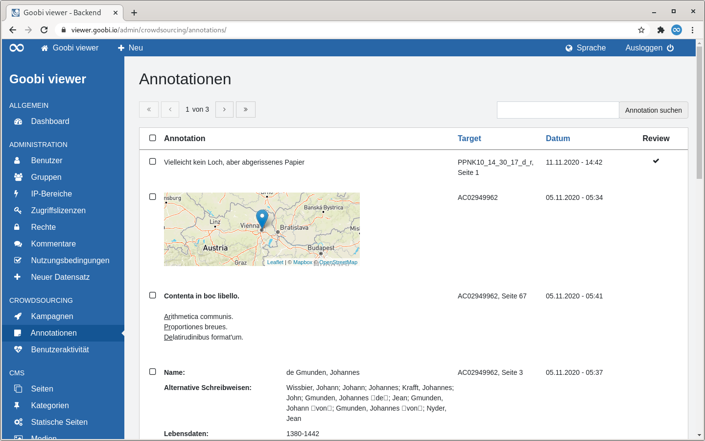

# 5.2.3.2 Annotationen

## Allgemein

Die Seite "Annotationen" listet alle in dem Crowdsourcing Kampagnen erstellten Annotationen in tabellarischer Form auf.

Oberhalb der Tabelle befindet sich zwei Bereiche:

* **Links**: Ein Paginator. In der Tabelle werden maximal 15 Einträge angezeigt. Enthält ein Trefferset mehr als diese 15 Einträge, kann dort in den Treffern navigiert werden.
* **Rechts**: Ein Suchschlitz. Gesucht wird im dem Annotationstext und dem Target

Wird die Überschrift einer Spalte als Link dargestellt besteht die Möglichkeit nach dieser Spalte zu sortieren. Fährt man mit der Maus über eine Überschrift zeigt einem ein kleiner Pfeil an wie sortiert werden würde wenn man klickt. Nach der Sortierung wird dieser Pfeil dauerhaft angezeigt.

Vor der ersten Tabellenspalte werden Checkboxen angezeigt. Über die Checkbox im Tabellentitel können alle angezeigten Werte an- oder abgewählt werden. Über die Checkboxen in den einzelnen Zeilen können auch nur diese ausgewählt werden.  
Ausgewählte Tabelleneinträge können dann als Excel-Datei exportiert werden. Dafür erscheint dann ein automatisch am Bildschirmende ein Overlay mit einem entsprechenden Button.

Die Tabelle zeigt in der ersten Spalte die Annotation an. Je nach Fragentyp werden hier auch die Antworten unterschiedlich angezeigt. Die zweite Spalte zeigt an, wo die Annotation erstellt wurde. In der dritten Spalte wird das Datum und die Uhrzeit angezeigt zu der die Annotation geschrieben wurde und die vierte Spalte zeigt an, ob ein Review stattgefunden hat.

Fährt man mit der Maus über eine Tabellenzeile werden in der ersten Spalte zwei Links angezeigt. Einer zum Anzeigen der Annotation im Kontext sowie einen zum Löschen der Annotation.

