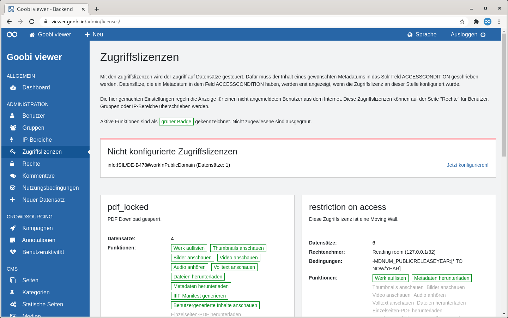

# 5.2.4 Zugriffslizenzen

## Allgemein

Mit den Zugriffslizenzen wird der Zugriff auf Datensätze gesteuert. Werke mit Zugriffslizenz sind automatisch gesperrt und damit nur für Administratoren sichtbar bis die Lizenz konfiguriert wurde.

Für ein Anwendungsbeispiel siehe auch Kapitel 6.8: [Konfiguration der Zugriffsbeschränkung](../../6/6.8/).

## Übersicht

Die Seite "Zugriffslizenzen" listet alle konfigurierten Zugriffslizenzen als Kacheln auf. Wenn nicht konfigurierte Lizenzen existieren wird darauf am Seitenanfang prominent hingewiesen.

Nach der Seitenüberschrift wird die Funktionalität der Zugriffslizenzen noch einmal beschrieben. Aktive und nicht zugewiesene Funktionen sind in den Kacheln als Badges gekennzeichnet. Dabei folgen die Farben der Badges dem folgenden Schema:

* **Grün**: Die Funktion ist aktiv
* **Grau**: Die Funktion ist nicht zugewiesen und steht damit für Datensätze mit dieser Zugriffslizenz nicht zur Verfügung 

Darunter erscheint optional der Bereich der auf die nicht konfigurierten Zugriffslizenzen hinweist.

Anschließend werden die konfigurierten Zugriffslizenzen in einer Kachelansicht dargestellt. Die Kacheln enthalten die folgenden Elemente:

<table>
  <thead>
    <tr>
      <th style="text-align:left">Element</th>
      <th style="text-align:left">Beschreibung</th>
    </tr>
  </thead>
  <tbody>
    <tr>
      <td style="text-align:left"><b>&#xDC;berschrift</b>
      </td>
      <td style="text-align:left">Der interne Wert der Lizenz wird als &#xDC;berschrift angezeigt.</td>
    </tr>
    <tr>
      <td style="text-align:left"><b>Hinweis</b>
      </td>
      <td style="text-align:left">Ist eine Lizenz als Moving Wall oder als Open Access markiert wird ein
        entsprechender Hinweistext angezeigt. Das gleiche gilt auch f&#xFC;r Lizenzen,
        die den gleichzeitigen Zugriff oder den prozentualen Anteil eines Werkes
        der pro Nutzersession heruntergeladen werden kann, einschr&#xE4;nken.</td>
    </tr>
    <tr>
      <td style="text-align:left"><b>Beschreibung</b>
      </td>
      <td style="text-align:left">Wurde f&#xFC;r eine Zugriffslizenz eine Beschreibung eingegeben ist diese
        in der Kachel sichtbar.</td>
    </tr>
    <tr>
      <td style="text-align:left"><b>Datens&#xE4;tze</b>
      </td>
      <td style="text-align:left">Die Anzahl der Datens&#xE4;tze, die diese Lizenz umfasst ist angegeben.
        Wird die Zahl angeklickt, so l&#xF6;st das eine Suche nach diesen Werken
        aus.</td>
    </tr>
    <tr>
      <td style="text-align:left"><b>Rechtenehmer</b>
      </td>
      <td style="text-align:left">Wenn einem Benutzer, einer Gruppe oder einem IP-Bereich f&#xFC;r diese
        Lizenz spezielle Rechte zugewiesen wurden, so werden die Rechtenehmer an
        dieser Stelle angezeigt.</td>
    </tr>
    <tr>
      <td style="text-align:left"><b>Bedingungen</b>
      </td>
      <td style="text-align:left">Wenn f&#xFC;r eine Lizenz eine Bedingung formuliert wurde wird sie hier
        angezeigt. Bedingungen m&#xFC;ssen zur Zeit nur f&#xFC;r eine Moving Wall
        formuliert werden.</td>
    </tr>
    <tr>
      <td style="text-align:left"><b>Funktionen</b>
      </td>
      <td style="text-align:left">
        
Hier wird eine Liste der aktiven und nicht zugewiesenen Funktionen angezeigt.
          Aktive werden als gr&#xFC;ner Badge visualisiert. Nicht zugewiesene Funktionen
          sind ausgegraut.

        
Ist eine Lizenz als &quot;Open Access&quot; markiert, dann werden keine
          Funktionen aufgelistet, da grunds&#xE4;tzlich alles erlaubt ist.

        
Betrifft eine Lizenz die Anzeige von Annotationen aus einer Kampagne,
          steht nur die Funktion &quot;Benutzergenerierte Inhalte anschauen&quot;
          zur Verf&#xFC;gung.

      </td>
    </tr>
  </tbody>
</table>

Fährt man mit der Maus über eine Kachel wird ein Link zum Bearbeiten oder Löschen der Zugriffslizenz sichtbar.


Das Löschen einer Zugriffslizenz ist nur Möglich wenn sie keine Rechtenehmer hat.


