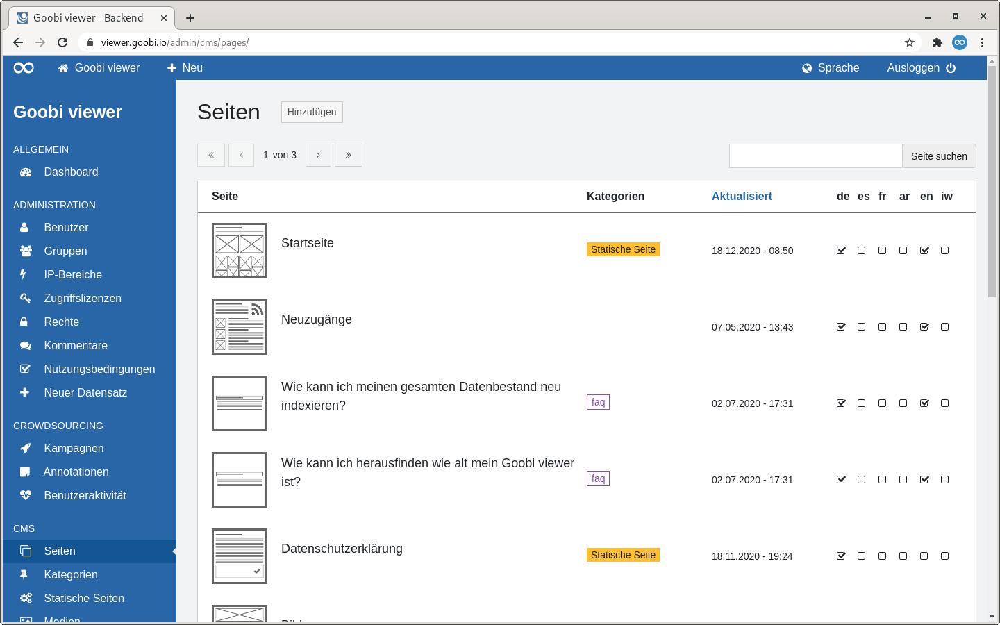

# 5.2.4.1 Seiten

Die Seite "Seiten" listet alle CMS-Seiten in tabellarischer Form auf.

Rechts neben der Seitenüberschrift befindet sich ein Button um eine neue CMS-Seite hinzuzufügen.

Oberhalb der Tabelle befindet sich zwei Bereiche:

* **Links**: Ein Paginator. In der Tabelle werden maximal 15 Einträge angezeigt. Enthält ein Trefferset mehr als diese 15 Einträge, kann dort in den Treffern navigiert werden.
* **Rechts**: Ein Suchschlitz. Gesucht wird im dem Seitentitel, den Kategorien und den Subthemes.

Wird die Überschrift einer Spalte als Link dargestellt besteht die Möglichkeit nach dieser Spalte zu sortieren. Fährt man mit der Maus über eine Überschrift zeigt einem ein kleiner Pfeil an wie sortiert werden würde wenn man klickt. Nach der Sortierung wird dieser Pfeil dauerhaft angezeigt.

Die Tabelle zeigt in der ersten Spalte eine Grafik an, die einen schematischen Eindruck vom Seitenaufbau gibt. Daneben steht der Seitentitel und der Menütitel der Seite, sofern dieser vom Seitentitel abweicht. Ist die CMS-Seite einem Subtheme zugewiesen ist das dort in Klammern ebenfalls ersichtlich.  
Die zweite Spalte zeigt an, ob einer Seite Kategorien \(violetter Badge\) zugewiesen wurden, oder ob sie als statische Seite \(oranger Badge\) festgelegt wurde. In der dritten Spalte stehen Datum und Uhrzeit, wann die CMS-Seiten das letzte Mal aktualisiert wurden. Am Ende folgt eine Auflistung der aktivierten Sprachen und die Visualisierung in Form von Checkboxen, ob die Übersetzung bereits fertig gestellt ist oder nicht.

Fährt man mit der Maus über eine Tabellenzeile erscheinen drei potentielle Links:

* **Bearbeiten**: Wechselt für die gewählte CMS-Seite in den Bearbeiten Modus
* **Vorschau**: Öffnet die gewählte CMS-Seite in einem neuen Tab
* **Löschen**: Löscht die CMS-Seite


Das Löschen einer CMS-Seite ist nur möglich, wenn sie nicht als statische Seite definiert oder im Menü verlinkt ist.


