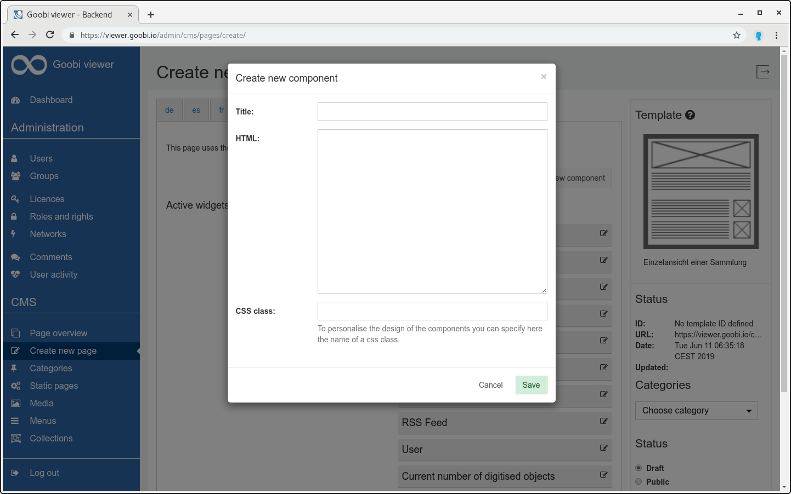
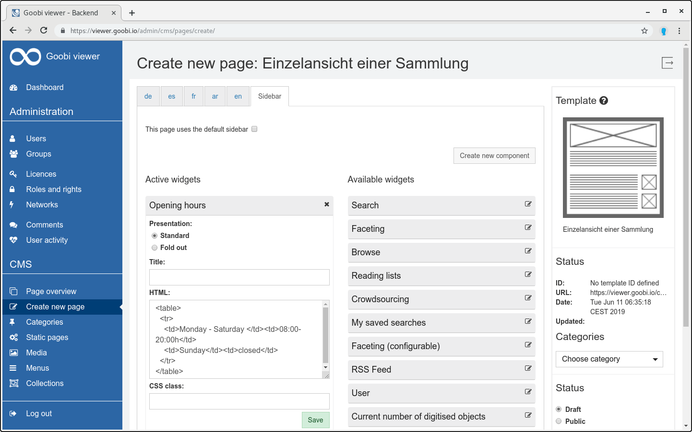

# 5.2.4.1.1.2 Eigene Komponente für die Seitenleiste

Nach einem Klick auf die Schaltfläche `Neue Komponente erstellen` kann der Benutzer eigene Elemente für die Seitenleiste erstellen. Es öffnet sich ein Dialogfenster, in dem der Inhalt der Komponente festgelegt werden kann.

Der Dialog erwartet einen Titel für die Komponente und den Inhalt. Der Inhalt kann aus reinem Text oder aus HTML bestehen. Nach einem Klick auf `Speichern`, taucht die neue Komponente in der Spalte `Aktive Widgets` auf.

Über den Widget Editor kann die Komponente nachträglich bearbeitet werden.

