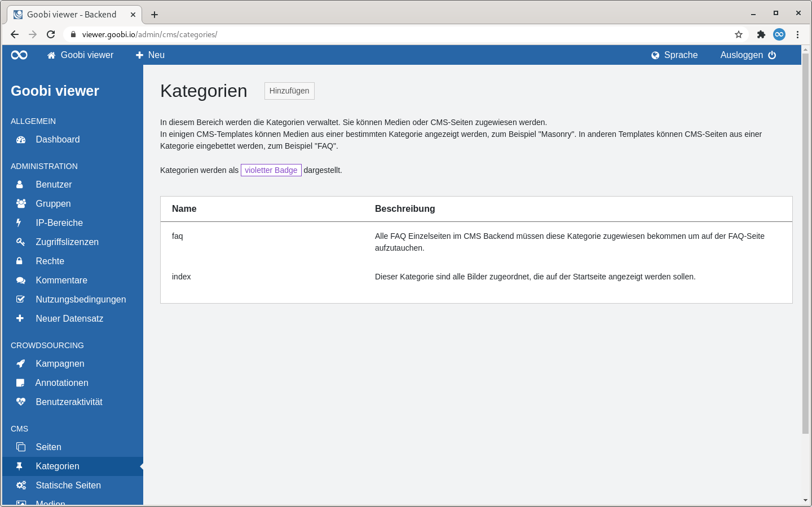
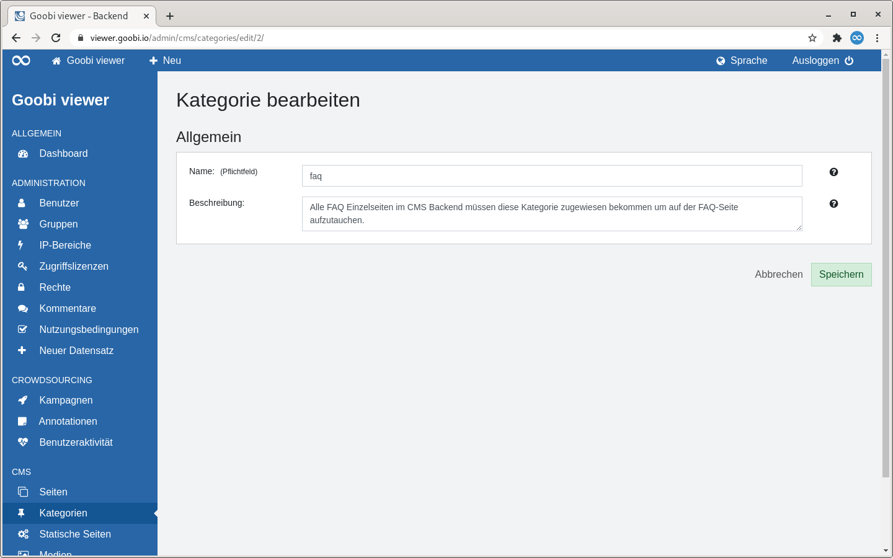

# 5.2.4.2 Kategorien

## Allgemein

Kategorien können Medien oder CMS-Seiten zugewiesen werden. In einigen CMS-Templates können dann nur Medien aus einer bestimmten Kategorie angezeigt werden, zum Beispiel "Masonry". In anderen Templates können CMS-Seiten aus einer Kategorie eingebettet werden, zum Beispiel "FAQ".

Kategorien werden in der Oberfläche als violetter Badge dargestellt.

## Übersicht

Die Seite "Kategorien" listet alle angelegten Kategorien in tabellarischer Form auf. 

Rechts neben der Seitenüberschrift befindet sich ein Button um eine neue Kategorie hinzuzufügen.

Anschließend folgt ein beschreibender Text zu der Verwendung von Kategorien. Darunter folgt die Darstellung der Kategorien in tabellarischer Form.

In der ersten Spalte der Tabelle wird der Name der Kategorie angezeigt. In der zweiten die Beschreibung.

Fährt man mit der Maus über eine Tabellenzeile wird in der ersten Spalte ein Link zum Bearbeiten oder Löschen der Kategorie sichtbar.


Das Löschen einer Kategorie ist nur möglich, wenn sie keiner Mediendatei und keiner CMS-Seite zugewiesen ist.


## Hinzufügen

Wird eine Kategorie hinzugefügt wird nur ein Abschnitt angezeigt: "Allgemein".

Der Name einer Kategorie ist ein Pflichtfeld. Die optionale Beschreibung hilft den Verwendungszweck der Kategorie festzuhalten. Sie ist nur für Administratoren sichtbar.

