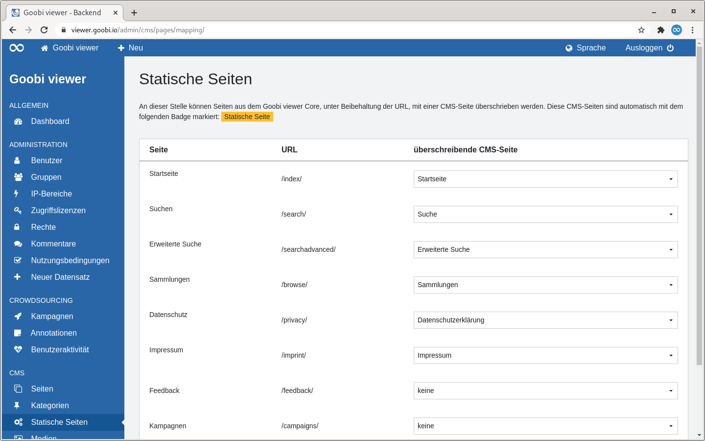

# 5.2.4.3 Statische Seiten

## Allgemein

Auf der Seite "Statische Seiten" können Seiten aus dem Goobi viewer Core, unter Beibehaltung der URL, mit einer CMS-Seite überschrieben werden. Diese CMS-Seiten sind automatisch mit einem orangenen Badge "Statische Seite" markiert.

## Bearbeiten

Die Seite "Statische Seiten" zeigt ein Formular in tabellarischer Form

In der ersten Tabellenspalte wird der der Name der Seite im Goobi viewer Core angezeigt. In der zweiten Spalte ist die Adresse über die die Seite aufgerufen wird ersichtlich. In der dritten Spalte kann eine überschreibende CMS-Seite ausgewählt werden.

Unter der Tabelle befindet sich ein Button zum Speichern.

