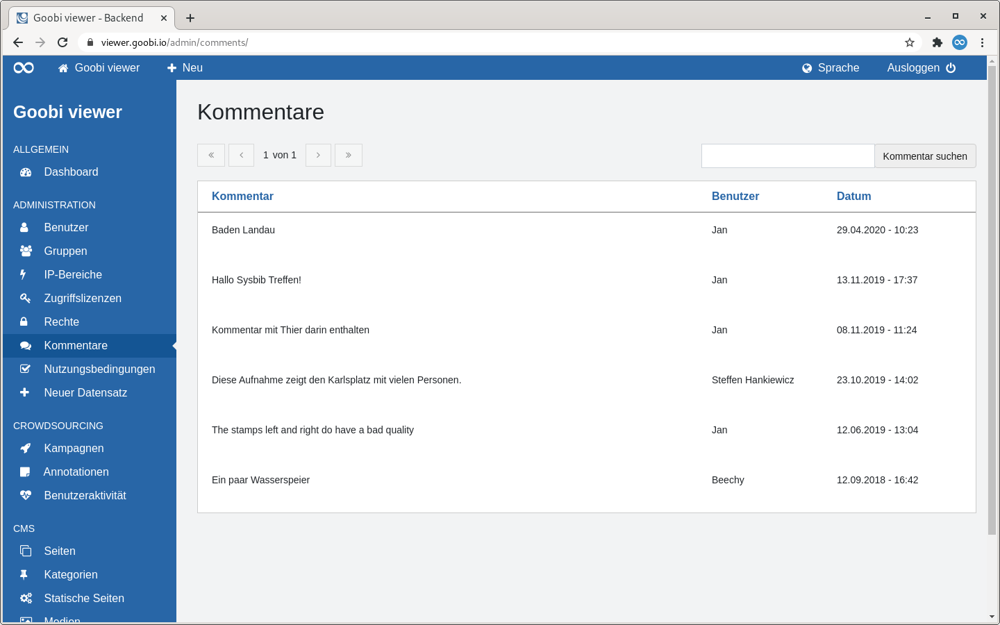

# 5.2.6 Kommentare

## Allgemein

Die Seite "Kommentare" listet alle im Frontend von Benutzern verfasste Kommentare in tabellarischer Form auf.

Oberhalb der Tabelle befindet sich zwei Bereiche:

* **Links**: Ein Paginator. In der Tabelle werden maximal 15 Einträge angezeigt. Enthält ein Trefferset mehr als diese 15 Einträge, kann dort in den Treffern navigiert werden.
* **Rechts**: Ein Suchschlitz. Gesucht wird im Kommentartext und in dem angezeigten Benutzernamen.

Wird die Überschrift einer Spalte als Link dargestellt besteht die Möglichkeit nach dieser Spalte zu sortieren. Fährt man mit der Maus über eine Überschrift zeigt einem ein kleiner Pfeil an wie sortiert werden würde wenn man klickt. Nach der Sortierung wird dieser Pfeil dauerhaft angezeigt.

Die Tabelle zeigt in der ersten Spalte den Kommentar. Die zweite Spalte zeigt den Benutzernamen an, der den Kommentar verfasst hat. In der dritten Spalte wird das Datum und die Uhrzeit angezeigt zu der der Kommentar geschrieben wurde. 

Fährt man mit der Maus über eine Tabellenzeile werden in der ersten Spalte zwei Links angezeigt. Einer zum Anzeigen des Kommentars im Kontext sowie einen zum Löschen des Kommentars.

