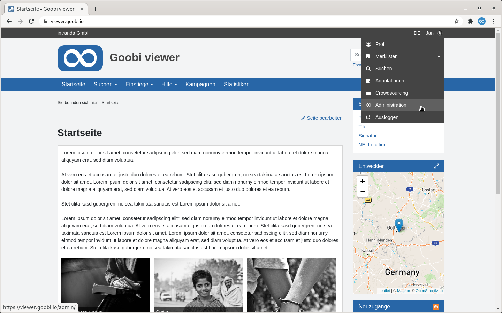

# 5.2 Backend

Das Backend ist nur für Administratoren sichtbar. Wenn ein Benutzeraccount Administratorenrechte verliehen bekommen hat, erscheint nach der Anmeldung im Benutzermenü der Punkt "Administration". Der Link führt zum Dashboard des Backends. Alternativ kann auch direkt die URL der Goobi viewer Instanz mit dem Suffix `/admin/` aufgerufen werden um direkt in das Backend zu gelangen.

