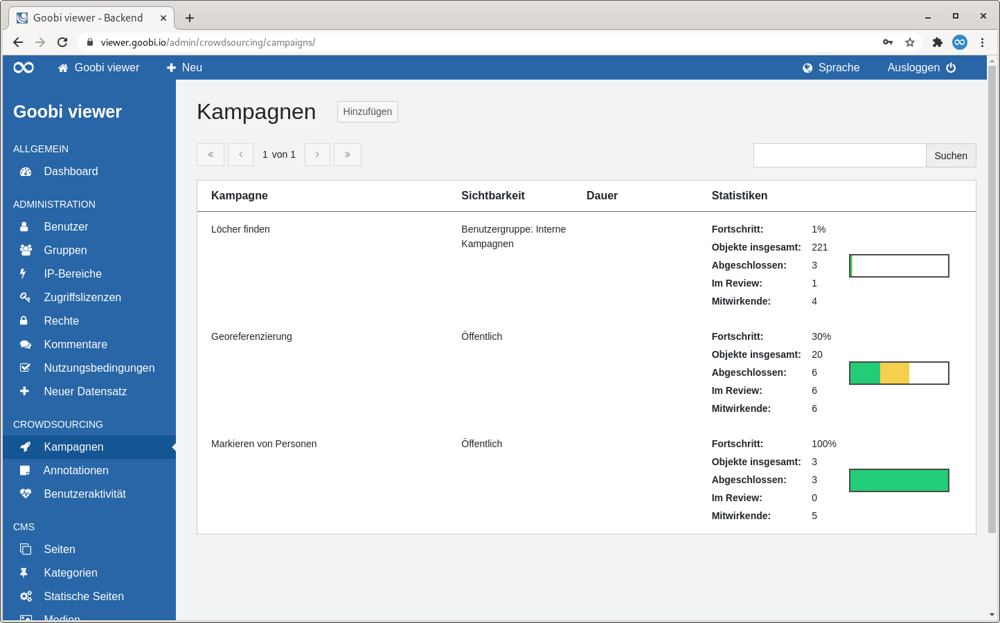

# 5.3.1 Kampagnen

## Übersicht

Die Seite "Kampagnen" listet alle Crowdsourcing Kampagnen in tabellarischer Form auf. 

Rechts neben der Seitenüberschrift befindet sich ein Button um eine neue Kampagne hinzuzufügen.

Oberhalb der Tabelle befindet sich zwei Bereiche:

* **Links**: Ein Paginator. In der Tabelle werden maximal 15 Einträge angezeigt. Enthält ein Trefferset mehr als diese 15 Einträge, kann dort in den Treffern navigiert werden.
* **Rechts**: Ein Suchschlitz. Gesucht wird im Namen der Kampagne

Die Tabelle zeigt in der ersten Spalte den Namen der Kampagne an. In der zweiten Spalte ist zu sehen, ob die Kampagne öffentlich sichtbar, oder auf eine Benutzergruppe eingeschränkt ist. Die dritte Spalte zeigt an, ob die Kampagne auf einen bestimmten Zeitraum eingeschränkt wurde. In der vierten Spalte sind verschiedene Statistiken über die Kampagne sichtbar.

Fährt man mit der Maus über eine Tabellenzeile wird in der ersten Spalte ein Link zum Bearbeiten oder zum Löschen der Kampagne sichtbar.

