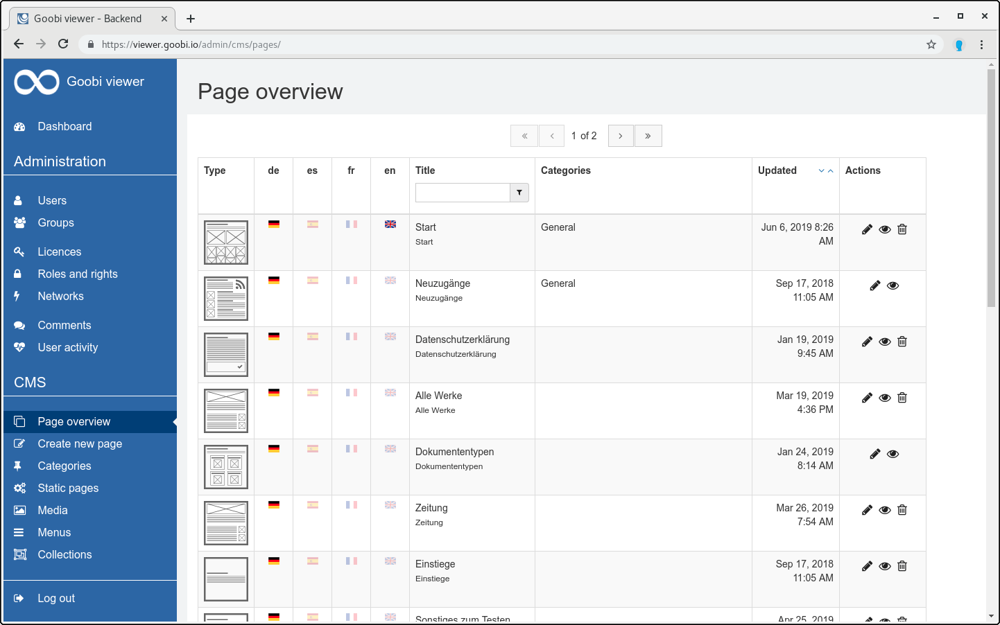

# 5.4.1 Seiten

Die gesamte Tabelle der Seitenübersicht lässt sich über die Sucheingabe filtern. So ist es zum Beispiel möglich nach einem Seitentitel zu suchen und die Tabelle wird nach dem eingegebenen Begriff gefiltert.

Seitenübersicht des CMS werden alle bisher erstellten Seiten aufgelistet. Die Tabelle ist wie folgt aufgegliedert:

| **Spalte**  | Beschreibung  |
| :--- | :--- |
| **Typ** | Der Typ der Seite beschreibt die Art des ausgewählten Templates in Form eines zugeordneten Symbols. |
| **de / es / fr / en**  | Diese Spalten zeigen, in welcher Sprache die Seite zur Verfügung steht. Ist die Landesflagge nicht ausgegraut, ist die Seite in die entsprechende Sprache übersetzt.  |
| **Titel**  | Diese Spalte listet den Titel der Seite auf. Die Tabelle ist auch nach Titeln sortierbar.   |
| **Kategorien**  | Diese Spalte listet die der Seite zugewiesenen Kategorien auf. |
| **Aktualisiert**  | Diese Spalte zeigt das Datum der letzten Aktualisierung an.  |
| **Aktionen**  | In dieser Spalte werden die für die Seite verfügbaren Aktionen angezeigt. Die Seite kann bearbeitet 🖋 , angesehen 👁🗨 oder gelöscht 🗑 werden.  |

