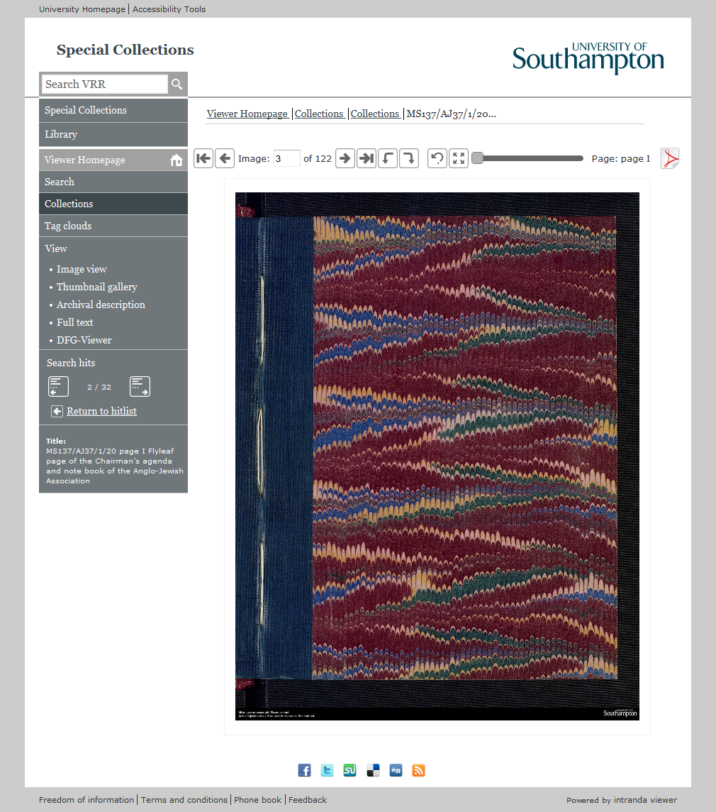

# 6.11 Überschreiben von Standard XHTML Seiten mit eigenen, angepassten Seiten

Der Goobi viewer bietet die Möglichkeit, standardmäßig enthaltene XHTML Seiten für die Anzeige von Werken durch angepasste Kopien zu überschreiben, um etwa gestalterische Anpassungen vorzunehmen, zusätzliche Seitenkomponenten einzufügen oder nicht benötigte Seitenkomponenten zu entfernen.

Hierfür werden einzelne PrettyFaces Mappings der URLs angepasst. Diese befinden sich in `/WEB-INF/pretty-standard-config.xml`. Eine ausführliche Beschreibung der Funktionsweise von PrettyFaces finden Sie unter [http://ocpsoft.org/prettyfaces.](http://ocpsoft.org/prettyfaces.)

Beispiel:

```markup
<pretty-config>
    <url-mapping id="image2">
        <pattern value="/image/#{pi:activeDocumentBean.persistentIdentifier}/#{imageToShow:activeDocumentBean.imageToShow}/" />
        <view-id value="/viewImage.xhtml" />
        <action onPostback="false">#{activeDocumentBean.open}</action>
    </url-mapping>
    <url-mapping id="image3">
        <pattern value="/image/#{pi:activeDocumentBean.persistentIdentifier}/#{imageToShow:activeDocumentBean.imageToShow}/#{logId:activeDocumentBean.logid}/" />
        <view-id value="/viewImage.xhtml" />
        <action onPostback="false">#{activeDocumentBean.open}</action>
    </url-mapping>
    <url-mapping id="image4">
        <pattern value="/image/#{action:activeDocumentBean.action}/#{pi:activeDocumentBean.persistentIdentifier}/#{imageToShow:activeDocumentBean.imageToShow}/#{logId:activeDocumentBean.logid}/" />
        <view-id value="/viewImage.xhtml" />
        <action onPostback="false">#{activeDocumentBean.open}</action>
    </url-mapping>
    [...]
</pretty-config>
```

Jedes &lt;url-mapping&gt; Element steht für ein bestimmtes URL Muster, zum Beispiel steht das unterste Element mit der ID “image4” für eine URL mit vier Parametern nach der Basis URL, nach dem Muster:

```text
http://viewer-url/image/param1/param2/param3/param4/
```

Für das Überschreiben des Mappings ist nur das Unterlement `<view-id>` relevant. Hier im Attribut `value` wird definiert, welche XHTML Seite für diese URL aufgerufen wird. Dabei ist dieser Pfad relativ zum Root Pfad der Webapplication im Apache Tomcat \(typischerweise `/var/lib/tomcat8/webapps/viewer/`\). Im obigen Beispiel verweisen alle URL Definitionen auf die Datei `/viewImage.xhtml` \(Vollständiger Pfad: `/var/lib/tomcat8/webapps/viewer/viewImage.xhtml`\). Soll eine bestimmte XHTML Seite überschreiben werden, müssen alle `<url-mapping>` Elemente, die auf diese Seite verweisen, überschrieben werden \(im obigen Beispiel also `image2`, `image3` und `image4`\).

Der Wert dieses Attributs kann nun auf eine beliebige andere Seite verweisen \(zum Beispiel typischerweise `/resources/themes/<IhrTheme>/urlMappings/viewImage.xhtml` \(relativ zum Root Pfad der Webapplikation\). Allerdings sollte diese Mapping Änderung nicht in der Datei `/WEB-INF/pretty-standard-config.xml` gemacht werden, da diese bei jedem Update des Goobi viewers mit der Standardversion überschrieben wird. Vielmehr wird hierfür eine zweite PrettyFaces Konfigurationsdatei in Ihrem Theme Ordner erstellt, die die Definitionen in der Standarddatei überschreibt. Diese befindet sich typischerweise unter `/resources/themes/<IhrTheme>/teme-url-mappings.xml`. Wenn Ihr Theme vorher keine Seitenüberschreibungen enthalten hat, existiert diese Datei noch nicht und muss erstellt werden.

In dieser Datei werden identische `<url-mapping>` Elemente angelegt:

```markup
<url-mapping id="image2">
    <pattern value="/image/#{pi:activeDocumentBean.persistentIdentifier}/#{imageToShow:activeDocumentBean.imageToShow}/" />
    <view-id value="/resources/themes/<IhrTheme>/urlMappings/viewImage.xhtml" />
    <action onPostback="false">#{activeDocumentBean.open}</action>
</url-mapping>

<url-mapping id="image3">
    <pattern value="/image/#{pi:activeDocumentBean.persistentIdentifier}/#{imageToShow:activeDocumentBean.imageToShow}/#{logId:activeDocumentBean.logid}/" />
    <view-id value="/resources/themes/<IhrTheme>/urlMappings/viewImage.xhtml" />
    <action onPostback="false">#{activeDocumentBean.open}</action>
</url-mapping>

<url-mapping id="image4">
    <pattern value="/image/#{action:activeDocumentBean.action}/#{pi:activeDocumentBean.persistentIdentifier}/#{imageToShow:activeDocumentBean.imageToShow}/#{logId:activeDocumentBean.logid}/" />
    <view-id value="/resources/themes/<IhrTheme>/urlMappings/viewImage.xhtml" />
    <action onPostback="false">#{activeDocumentBean.open}</action>
</url-mapping>
```

Zu beachten ist, dass sich die Werte von `/view-id/@value` unterscheiden:

```text
/resources/themes/<IhrTheme>/urlMappings/viewImage.xhtml
```

`<IhrTheme>` wird dabei durch den Ordnernamen Ihres Themes ersetzt, der sich an dieser Stelle unter `/themes` befindet. Der Unterordner `urlMappings` existiert vermutlich noch nicht und muss erstellt werden. Anschließend kann man zunächst die Standard Version der Datei `viewImage.xhtml` aus dem Root Pfad der Webapplikation dorthin kopieren und in dieser Kopie eigene Anpassungen vornehmen.



Zu aller Letzt muss noch die Datei `theme-url-mappings.xml` im Goobi viewer eingebunden werden, damit die Überschreibungen greifen. Dazu muss in der Datei `/WEB-INF/web.xml` das folgende Element angepasst werden:

```markup
<context-param>
    <param-name>com.ocpsoft.pretty.CONFIG_FILES</param-name>
    <param-value>/resources/themes/YOURTHEMENAME/theme-url-mappings.xml, /WEB-INF/pretty-standard-config.xml</param-value>
</context-param>
```

Hier ist darauf zu achten, dass im Unterelement `<param-value>` die neue Datei und die Standarddatei kommasepariert aufgelistet werden.

Die neue Datei muss an erster Stelle stehen, damit die dortigen Definitionen priorisiert werden.


Falls Sie Ihr Corporate Design selbst verwalten, befindet sich Ihr Theme höchstwahrscheinlich nicht in der Repository von intranda, so dass beim Bau der Applikation keine Rücksicht auf die zuletzt beschrieben Änderung in web.xml genommen wird, und diese immer wieder durch die Standardversion überschrieben wird. Um dies zu vermeiden, kann ein entsprechender Eintrag im Build-Script des Goobi viewers für Ihr Theme hinzugefügt werden. Hierfür wenden Sie sich bitte an suppport@intranda.com


Anschließend muss der Apache Tomcat neu gestartet werden, damit die neuen Mappings greifen.

Diese Einträge in der PrettyFaces Konfiguration müssen Sie für jede XHTML Seite durchführen, die Sie individuell anpassen möchten \(etwa Seiten für Volltexte, Metadaten Inhaltsverzeichnis, Suche, etc.\). Außerdem können zusätzliche, komplett individuell erstellte Seiten mit neuen Pretty URLs definiert werden, zum Beispiel

```markup
<url-mapping>
 <pattern value="/tour/" />
 <view-id value="/resources/themes/<IhrTheme>/tour/tour.xhtml" />
</url-mapping>
```

