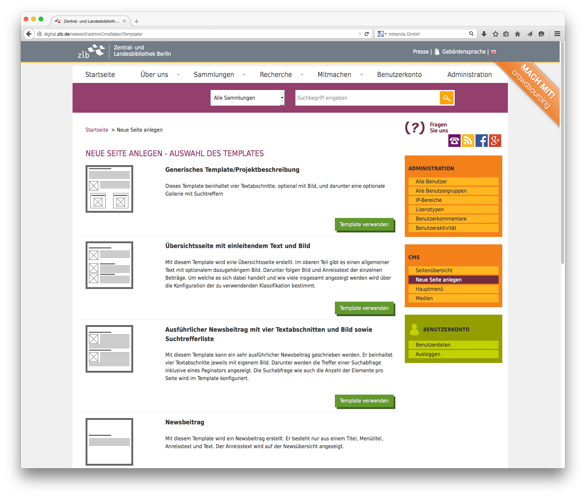

# 6.4. CMS-Templates im Goobi viewer

Ab der Version 3.0 verfügt der Goobi viewer über eine CMS-Funktionalität. Diese basiert auf der vorherigen Erstellung von frei konfigurierbaren Templates, die dann innerhalb des CMS-Bereiches beliebig oft Verwendung finden können. 

Die Template-Datei hat dabei stets einen beispielhaften Aufbau:

