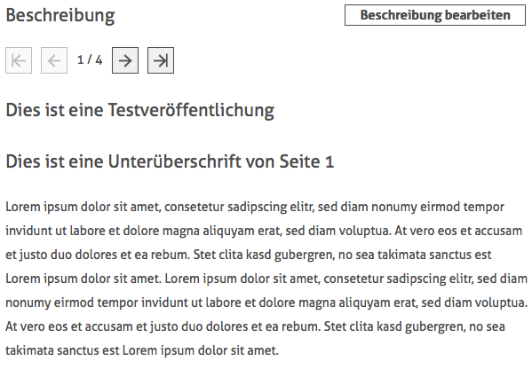
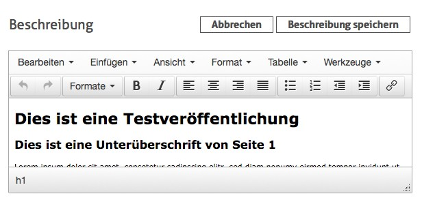
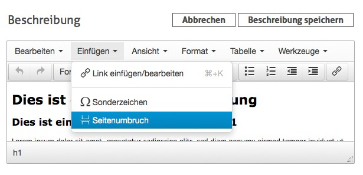

# 6.8.3 Beschreibung zur Übersichtsseite hinzufügen / bearbeiten

Um ein Werk mit einem Beschreibungstext zu versehen, klickt man auf die Schaltfläche `Beschreibung` bearbeiten.   

Ein Texteditor wird nun angezeigt, der es ermöglicht die Beschreibung zu verfassen. Zu diesem Zweck stehen alle innerhalb von HTML erlaubten Arten der Textformatierung zur Verfügung.  

Beschreibungen können auf mehrere Seiten aufgeteilt werden. Um eine neue Seite zu erstellen, muss im Fließtext ein Seitenumbruch hinzugefügt werden. Hierfür wird im Menü des Editors einfach auf `Einfügen -> Seitenumbruch` geklickt. Anschließend ist ein optischer Trenner innerhalb des Textes sichtbar. Der Text nach dem Trenner wird innerhalb der späteren Anzeige somit als neue Seite interpretiert und dargestellt.

Enthält die Beschreibung mehrere Seiten, wird ein Paginator angezeigt, der die Navigation durch die Seiten ermöglicht.

Für eine komfortablere Bearbeitung der Beschreibung steht im Texteditor auch ein Vollbildmodus zur Verfügung. Diesen erreicht man, indem im Menü des Editors auf `Ansicht -> Vollbid` geklickt wird. Den Vollbildmodus verlassen kann man auf dieselbe Weise. Nachdem alle Änderungen an der Beschreibung abgeschlossen sind, speichert man das Ergebnis mit Klick auf die Schaltfläche `Beschreibung speichern`.

