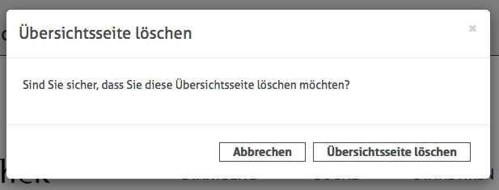

# 6.8.5 Übersichtsseite löschen

Um eine Übersichtsseite zu löschen reicht ein Klick auf die Schaltfläche `Übersichtsseite löschen`.   

Zur Sicherheit muss dieser Schritt noch einmal über ein Dialogfenster bestätigt werden.  

Sobald die Löschung bestätigt wurde, wird die Seite gelöscht und der entsprechende Datenbankeintrag entfernt. Damit ist die Entfernung endgültig.  

