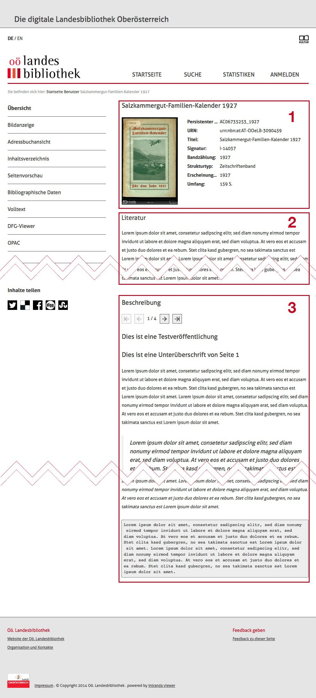

# 6.8 Die Funktionalitäten der Übersichtsseite

In diesem Abschnitt erfahren Sie einige grundlegende Details der Funktionalitäten der Übersichtsseite, welche Ihnen ermöglicht Metadaten, Literaturangaben und Beschreibungen zum Werk zu repräsentieren. Die Übersichtsseite ist in drei Bereiche unterteilt. Der erste Bereich repräsentiert die zum Werk gehörigen Metadaten inklusive einer Bildvorschau. Der zweite zeigt eine individualisierbare Literaturangabe zum Werk und der dritte besteht aus einem frei gestaltbaren Text für Beschreibungen zum Werk.

Alle Bereiche lassen sich anpassen und es können Elemente hinzugefügt oder entfernt werden. Auch eine komplette Löschung der Übersichtsseite ist möglich. Für diese Funktionen muss sich ein Benutzer im Goobi viewer anmelden und über administrative Rechte verfügen. Alternativ muss dem Benutzeraccount das Recht zum Bearbeiten der Übersichtsseite über das Lizenzmanagement zugewiesen sein. 

In den folgenden Erklärungen wird jeweils davon ausgegangen, dass diese Bedingung erfüllt ist.   

