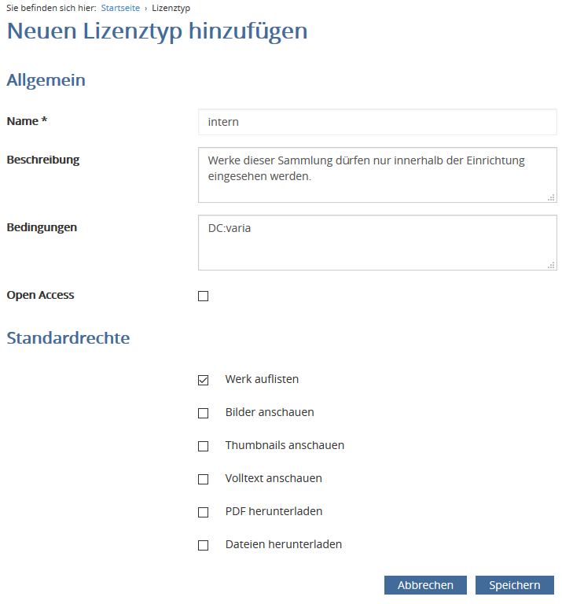

# 6.9.1 Lizenztypen

Im Admin-Backend des Goobi viewers müssen Lizenztypen angelegt werden. Ein Lizenztyp definiert das Standardverhalten von Werken mit der entprechenden Access Condition für normale Benutzer \(das heißt Benutzer, die keine Administratoren oder sogenannte Lizenznehmer sind und nicht aus priviligierten IP-Bereichen kommen\).

Über den Menüpunkt „Lizenztypen“ gelagt man zur Liste der existierenden Lizenztypen. Um einen neuen Lizenztyp zu erstellen, muss über den Link „Neuen Lizenztyp hinzufügen“ die Erstellungsmaske geöffnet werden. Diese besitzt folgende Eingabefelder:

| **Name** | Der Name des Lizenztyps muss der zugehörigen Access Condition entsprechen \(Groß-/Kleinschreibung muss hier beachtet werden\). |
| --- | --- | --- | --- | --- | --- | --- | --- | --- | --- | --- |
| **Beschreibung** | Freitext-Beschreibung zu diesem Lizenztyp. |
| **Bedingungen** | Eine optionale Solr-Query, um den Wirkungskreis dieses Lizenztyps auf bestimmte Werke einzuschränken. Dies bedeutet, dass nur für Werke, die dieser Query entsprechen, auch die konfigurierten Einschränkungen dieses Lizenztyps gelten. Alle anderen Werke werden die Einstellungen dieses Lizenztyps ignorieren. |
| **OpenAccess** | Ist ein Lizenztyp als Open Access definiert, werden alle konfigurierten Einschränkungen ignoriert, und das Werk darf frei eingesehen werden. |
| **Standardrechte** | Standardberechtigungen gelten für alle Benutzer. Alle hier nicht ausgewählten Rechte müssen anschließend explizit als Lizenz vergeben werden. |
| **Werk auflisten** | Diese Berechtigung steuert die Sichtbarkeit von Werken insgesamt. Ist dieses Recht nicht vergeben, erscheinen die Werke nicht in Suchergebnissen, werden nicht in Sammlungen aufgelistet und lassen sich nicht öffnen \(der Benutzer bekommt die Meldung, dass das betreffende Werk nicht existiert\). |
| **Bilder anschauen** | Bildanzeige im Normalen- und im Vollbild-Modus. |
| **Thumbnails anschauen** | Anzeige von Thumbnails zu den betreffenden Werken \(Suchergebnisse und Seitenansicht\). |
| **Volltext anschauen** | Volltext-Ansicht der betreffenden Werke. |
| **PDF herunterladen** | PDF-Dokumente aus den betreffenden Werken generieren. |
| **Dateien herunterladen** | Den betreffenden Werken zugeordnete Quelldateien \(zum Beispiel Born-Digital-Dokumente\) herunterladen. |

Nach der Erstellung wird der neue Lizenztyp auf der Seite `Lizenztypen` mit aufgelistet. Dort kann er bei Bedarf zum Bearbeiten geöffnet oder gelöscht werden.


Die statischen Lizenztypen `Repräsentaten setzen`, `Übersichtsseiten erstellen` und `OCR-Seiten löschen` werden für die entsprechenden Funktionen des Goobi viewers benötigt und können nicht verändert oder gelöscht werden.


