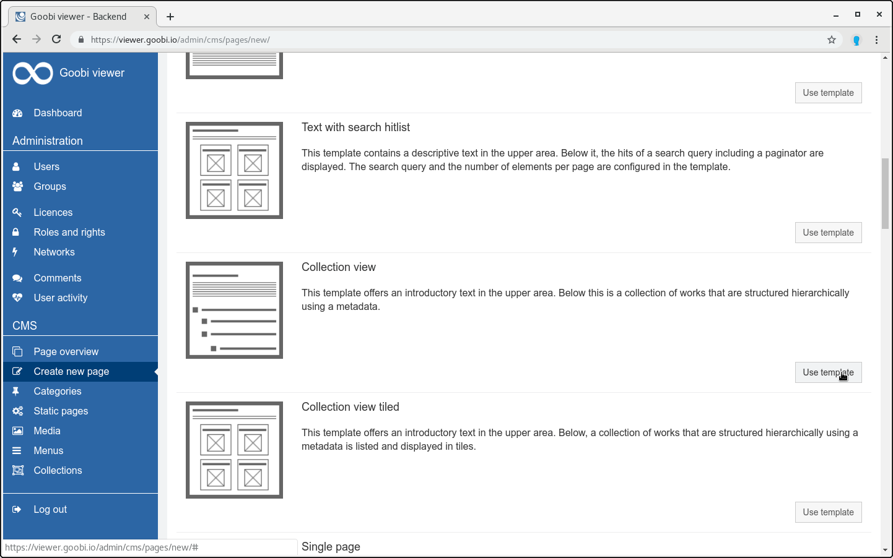
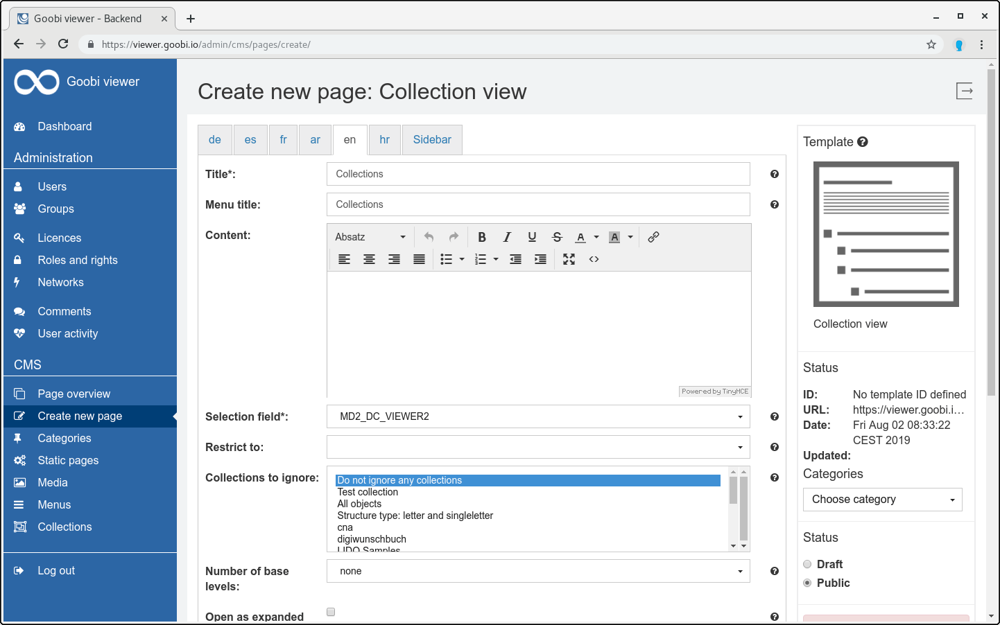
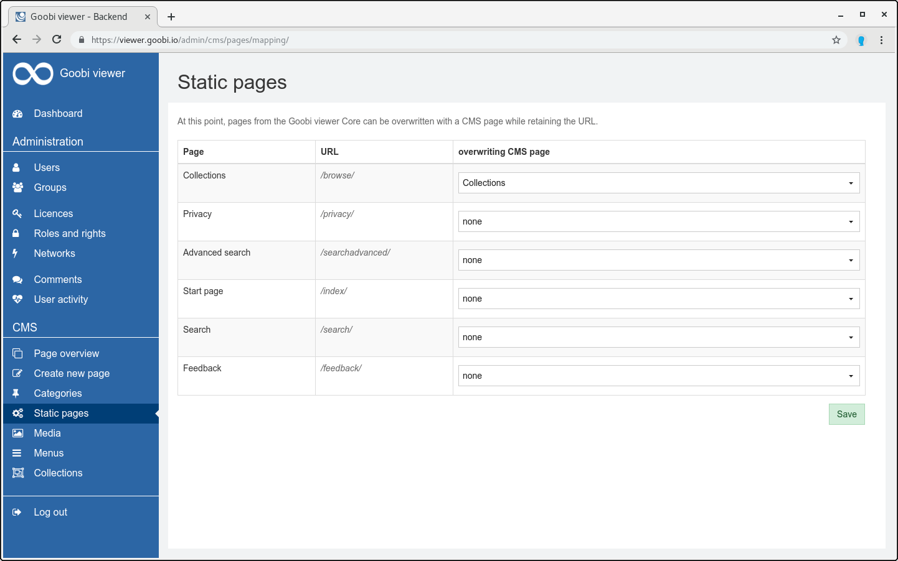
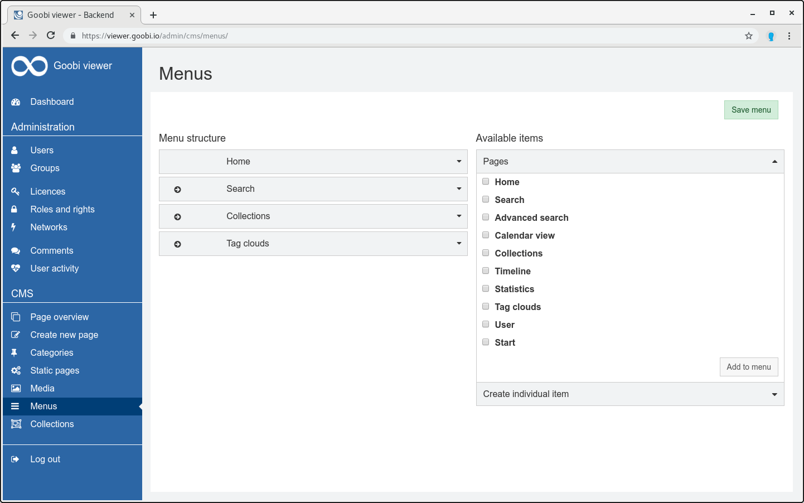

# 6.13.4 Goobi viewer: Anzeigen von individuellen Sammlungen

## Konfiguration Goobi viewer Indexer

Zuerst müssen die exportierten Sammlungen innerhalb des Solr Index in ein eigenständiges Feld geschrieben werden. Dafür muss in der Konfigurationsdatei `solr_indexerconfig.xml` folgende Felddefinition hinzugefügt werden:



```markup
<fields>
    <MD2_DC_VIEWER2>
        <list>
            <item>
                <xpath>mets:xmlData/mods:mods/mods:classification[@authority='z']</xpath>
                <getparents>all</getparents>
                <onetoken>true</onetoken>
                <onefield>false</onefield>
                <urlEncoding>false</urlEncoding>
                <addToDefault>false</addToDefault>
                <splittingCharacter>#</splittingCharacter>
                <addUntokenizedVersion>false</addUntokenizedVersion>
                <lowercase>true</lowercase>
                <addToChildren>true</addToChildren>
                <addToPages>true</addToPages>
            </item>
        </list>
    </MD2_DC_VIEWER2>
</fields>
```



## Konfiguration Goobi viewer Core

Dieses Feld muss nun anstelle des sonst üblichen Feldes `DC` in der lokalen config\_viewer.xml konfiguriert werden. Zum Beispiel:



```markup
<!-- Show MD2_DC_VIEWER2 instead of DC as collection field at the metadata page -->
<metadata>
    <mainMetadataList>
        <template name="_DEFAULT">
            <metadata label="MD2_DC_VIEWER2" value="">
                <param type="translatedfield" key="MD2_DC_VIEWER2_UNTOKENIZED" />
            </metadata>
        </template>
    </mainMetadataList>
</metadata>

<!-- Use MD2_DC_VIEWER2 instead of DC for facetting and in advanced search -->
<search>
    <drillDown>
        <field initialElementNumber="3">YEAR</field>
        <hierarchicalField initialElementNumber="3">MD2_DC_VIEWER2</hierarchicalField>
        <field initialElementNumber="3">DOCSTRCT_TOP</field>
        <field initialElementNumber="3">DOCSTRCT_SUB</field>
        <field initialElementNumber="3" sortOrder="alphabetical_asc">MD_PLACEPUBLISH</field>
    </drillDown>
    
    <advanced>
        <searchFields>
            <field>DEFAULT</field>
            <field>FULLTEXT</field>
            <field>CMS_TEXT_ALL</field>
            <field>PI_TOPSTRUCT</field>
            <field hierarchical="true">MD2_DC_VIEWER2</field>
            <field>DOCSTRCT_TOP</field>
            <field>DOCSTRCT_SUB</field>
            <field>MD_TITLE</field>
            <field>MD_CREATOR</field>
            <field>MD_PUBLISHER</field>
            <field>MD_PLACEPUBLISH</field>
            <field>MD_YEARPUBLISH</field>
            <field untokenizeForPhraseSearch="true">MD_SHELFMARK</field>
        </searchFields>
    </advanced>
</search>

<!-- Additional configuration such as for the breadcrumbs for MD_DC_VIEWER2 -->
<collections>
    <collection field="MD2_DC_VIEWER2">
        <addHierarchyToBreadcrumbs>true</addHierarchyToBreadcrumbs>
    </collection>
    <redirectToWork>false</redirectToWork>
</collections>
```



Außerdem muss der Feldname natürlich in den messages Dateien entsprechend übersetzt werden. Zum Beispiel:



```text
MD2_DC_VIEWER2=Sammlung
```



## CMS Sammlungsseite

Für die Anzeige einer Sammlungsseite mit eigenem Baum muss nun im Goobi viewer Backend eine neue CMS Seite basierend auf dem Template "Sammlungsanzeige" angelegt, konfigurier, als überschriebene statische Seite sowie im Menü verlinken werden:









