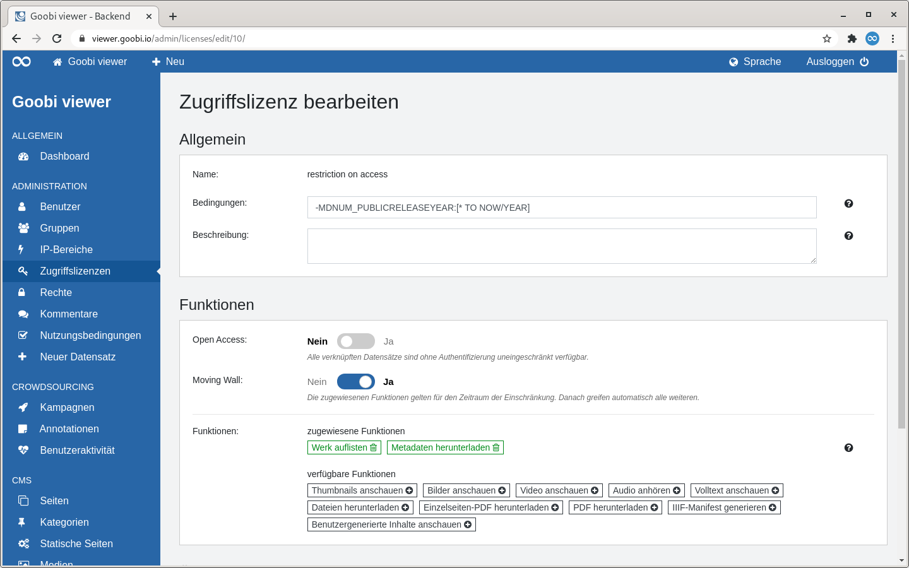

# 6.3 Moving Wall

## Allgemein

Der Goobi viewer kann Zugriffsbeschränkungen zeitversetzt aktivieren beziehungsweise aufheben.

## Goobi workflow

So kann zum Beispiel die Zugriffsbeschränkung für Werke, deren Regelschutzfrist zu einem bestimmten Zeitpunkt abläuft, so konfiguriert werden, dass diese Werke bis zu diesem Zeitpunkt nur für bestimmte Benutzer sichtbar sind und ab diesem Zeitpunkt für die Allgemeinheit freigeschaltet werden.

In Goobi workflow muss dafür ein Metadatum existieren, in dem eine Jahreszahl erfasst wurde. Hier ein Beispiel für die relevanten Sektionen innerhalb eines Regelsatzes:


```markup
<MetadataType>
    <Name>PublicReleaseYear</Name>
    <language name="de">Anzeige im Internet ab Jahr</language>
    <language name="en">Public release year</language>
</MetadataType>

[...]

<metadata num="1o" DefaultDisplay="true">PublicReleaseYear</metadata>

[...]

<Metadata>
    <InternalName>PublicReleaseYear</InternalName>
    <WriteXPath>./mods:mods/#mods:accessCondition[@type='restriction on access']</WriteXPath>
</Metadata>
```


## Goobi viewer Indexer

Dieses Metadatum muss im Goobi viewer Indexer anschließend indexiert werden. Hier eine Beispielkonfiguration:


```markup
<ACCESSCONDITION>
    <list>
        <item>
            <xpath>mets:xmlData/mods:mods/mods:accessCondition[@type='restriction on access']/@type</xpath>
            <addToDefault>false</addToDefault>
            <addUntokenizedVersion>false</addUntokenizedVersion>
        </item>
    </list>
</ACCESSCONDITION>

<MDNUM_PUBLICRELEASEYEAR>
    <list>
        <item>
            <xpath>mets:xmlData/mods:mods/mods:accessCondition[@type='restriction on access']</xpath>
            <addToDefault>false</addToDefault>
            <addUntokenizedVersion>false</addUntokenizedVersion>
            <addToChildren>true</addToChildren>
            <addToPages>true</addToPages>
        </item>
    <list>
</MDNUM_PUBLICRELEASEYEAR>
```


Wichtig ist, dass beide Inhalte indexiert werden: einmal die Information, dass es eine Zugriffsbeschränkung gibt \(Feld `ACCESSCONDITION`\) und einmal den Inhalt des Feldes \(Feld `MDNUM_PUBLICRELEASEYEAR)`

## Goobi viewer Backend

Nun muss im Goobi viewer Core Administratoren Backend die neue Zugfiffslizenz konfiguriert werden, dessen Name dem Wert in `ACCESSCONDITION` entspricht. In dem obigen Beispiel lautet dieser `restriction on access`. Alle Funktionen, die dieser Lizenztyp für beliebige Benutzer vergeben soll, werden dabei aktiviert.

Fehlt einem Lizenztyp die Berechtigung `Werk auflisten`, wird das Werk ohne eine entsprechendes individuelles Recht nicht im Goobi viewer auffindbar sein. Für maschinell abfragbare Schnittstellen \(OAI, SRU\) ist das Werk grundsätzlich gesperrt, unabhängig von etwaigen Berechtigungen des Benutzers.

Um Zeitpunktabhänigkeit im Lizenztyp zu konfigurieren, muss im Feld "Bedingungen" eine Sub-Query für Apache Solr eingetragen werden, die als Basis für die Gültigkeit dieses Lizenztyps gilt:

```text
-MDNUM_PUBLICRELEASEYEAR:[* TO NOW/YEAR]
```

In dem obigen Beispiel enthält das Metadatenfeld `MDNUM_PUBLICRELEASEYEAR` das Jahr, ab dem es frei zugänglich gemacht werden soll. Die oben genannte Sub-Query definiert, dass der Lizenztyp nur für Werke gilt, deren Wert im Metadatenfeld `MDNUM_PUBLICRELEASEYEAR` im Wertebereich nicht zwischen minus unendlich und dem aktuellen Jahr liegt. Dies bedeutet, dass \(angenommen das aktuelle Jahr ist 2018\) ein Werk mit dem Metadatenwert ab 2019 von diesem Lizenztyp regulär, das heißt mit allen konfigurierten Einschränkungen, behandelt wird.

Ein Werk mit dem Wert 2018 und kleiner wird nicht von der konfigurierten Sub-Query erfasst. In diesem Fall greifen die Einschränkungen der Zugriffslizenz nicht, obwohl das Werk den Namen dieses Zugriffslizenz eigentlich in mods:accessCondition trägt.



Es ist auch möglich nicht nur mit Jahren sondern auch mit Tagen zu arbeiten.Die Bedingung im Feld muss dafür wie folgt lauten:

```text
​​-DATE_PUBLICRELEASEDATE:[* TO NOW/DAY]
```

Das Feld wird im Index wie folgt konfiguriert:


```markup
<DATE_PUBLICRELEASEDATE>
    <list>
        <item>
            <xpath>mets:xmlData/mods:mods/mods:accessCondition[@type='restriction on access']</xpath>
            <addToDefault>false</addToDefault>
            <addUntokenizedVersion>false</addUntokenizedVersion>
            <addToChildren>true</addToChildren>
            <addToPages>true</addToPages>
        </item>
    </list>
</DATE_PUBLICRELEASEDATE>
```


