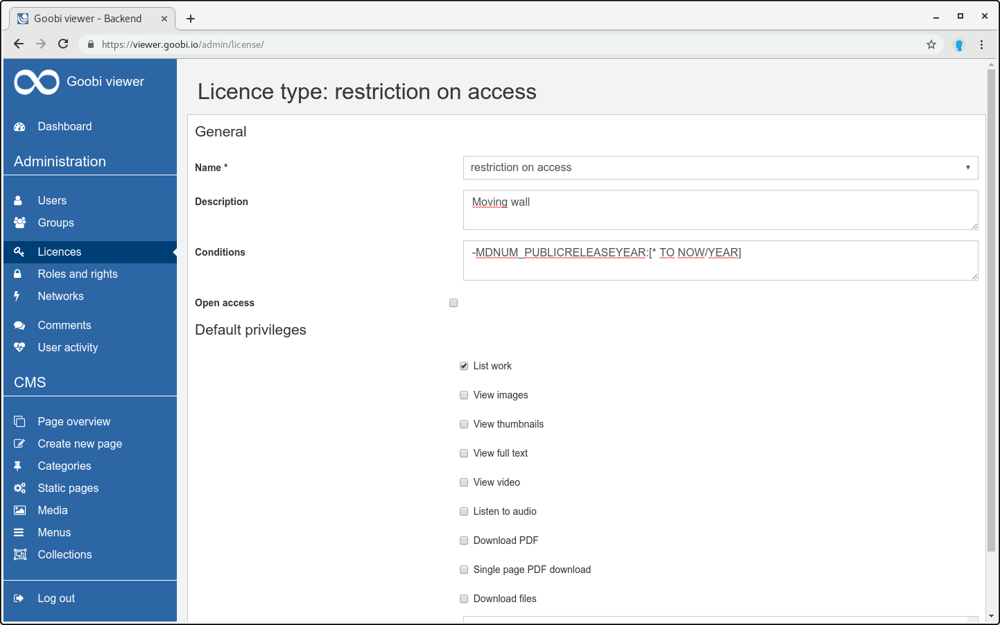

# 6.7.1 Lizenztypen

Im Admin-Backend des Goobi viewers müssen Lizenztypen angelegt werden. Ein Lizenztyp definiert das Standardverhalten von Werken mit der entprechenden Access Condition für normale Benutzer \(das heißt Benutzer, die keine Administratoren oder sogenannte Lizenznehmer sind und nicht aus priviligierten IP-Bereichen kommen\).

Über den Menüpunkt „Lizenztypen“ gelagt man zur Liste der existierenden Lizenztypen. Um einen neuen Lizenztyp zu erstellen, muss über den Link „Neuen Lizenztyp hinzufügen“ die Erstellungsmaske geöffnet werden. Diese besitzt folgende Eingabefelder:

<table>
  <thead>
    <tr>
      <th style="text-align:left"><b>Feld</b>
      </th>
      <th style="text-align:left">Beschreibung</th>
    </tr>
  </thead>
  <tbody>
    <tr>
      <td style="text-align:left"><b>Name</b>
      </td>
      <td style="text-align:left">Der Name des Lizenztyps muss der zugeh&#xF6;rigen Access Condition entsprechen
        (Gro&#xDF;-/Kleinschreibung muss hier beachtet werden).</td>
    </tr>
    <tr>
      <td style="text-align:left"><b>Beschreibung</b>
      </td>
      <td style="text-align:left">Freitext-Beschreibung zu diesem Lizenztyp.</td>
    </tr>
    <tr>
      <td style="text-align:left"><b>Bedingungen</b>
      </td>
      <td style="text-align:left">
        
Eine optionale Solr-Query, um den Wirkungskreis dieses Lizenztyps auf
          bestimmte Werke einzuschr&#xE4;nken. Dies bedeutet, dass nur f&#xFC;r Werke,
          die dieser Query entsprechen, auch die konfigurierten Einschr&#xE4;nkungen
          dieses Lizenztyps gelten. Alle anderen Werke werden die Einstellungen dieses
          Lizenztyps ignorieren.

        
Es ist auch m&#xF6;glich, in diesem Feld Bedingungen f&#xFC;r den Download
          von Dateien in Abh&#xE4;ngigkeit vom Dateinamen unterzubringen. Dazu kann
          ein <a href="http://www.regexe.de/hilfe.jsp">Regul&#xE4;rer Ausdruck</a> in
          der Form<code>FILENAME:{&lt;regul&#xE4;rer Ausdruck&gt;}</code> eingegeben
          werden. Alle downloadbaren Dateien, deren Dateiname auf den Regul&#xE4;ren
          Ausdruck passt, werden damit vom Lizenztyp erfasst und somit gesch&#xFC;tzt.
          Daf&#xFC;r muss das Recht &quot;Dateien herunterladen&quot; nicht aktiv
          sein. Andere Dateien sind davon ausgenommen. Dieser Ausdruck kann allein
          oder zus&#xE4;tzlich - durch Leerzeichen getrennt - zu den normalen Solr-Query
          Bedingungen eingetragen werden.

      </td>
    </tr>
    <tr>
      <td style="text-align:left"><b>OpenAccess</b>
      </td>
      <td style="text-align:left">Ist ein Lizenztyp als Open Access definiert, werden alle konfigurierten
        Einschr&#xE4;nkungen ignoriert, und das Werk darf frei eingesehen werden.</td>
    </tr>
    <tr>
      <td style="text-align:left"><b>Standardrechte</b>
      </td>
      <td style="text-align:left">Standardberechtigungen gelten f&#xFC;r alle Benutzer. Alle hier nicht
        ausgew&#xE4;hlten Rechte m&#xFC;ssen anschlie&#xDF;end explizit als Lizenz
        vergeben werden.</td>
    </tr>
    <tr>
      <td style="text-align:left"><b>Werk auflisten</b>
      </td>
      <td style="text-align:left">Diese Berechtigung steuert die Sichtbarkeit von Werken insgesamt. Ist
        dieses Recht nicht vergeben, erscheinen die Werke nicht in Suchergebnissen,
        werden nicht in Sammlungen aufgelistet und lassen sich nicht &#xF6;ffnen
        (der Benutzer bekommt die Meldung, dass das betreffende Werk nicht existiert).</td>
    </tr>
    <tr>
      <td style="text-align:left"><b>Bilder anschauen</b>
      </td>
      <td style="text-align:left">Bildanzeige im Normalen- und im Vollbild-Modus.</td>
    </tr>
    <tr>
      <td style="text-align:left"><b>Video anschauen</b>
      </td>
      <td style="text-align:left">Videoanzeige im Normalen- und im Vollbild-Modus</td>
    </tr>
    <tr>
      <td style="text-align:left"><b>Audio anh&#xF6;ren</b>
      </td>
      <td style="text-align:left">Audioplayer im Normalen- und im Vollbild-Modus</td>
    </tr>
    <tr>
      <td style="text-align:left"><b>Thumbnails anschauen</b>
      </td>
      <td style="text-align:left">Anzeige von Thumbnails zu den betreffenden Werken (Suchergebnisse und
        Seitenansicht).</td>
    </tr>
    <tr>
      <td style="text-align:left"><b>Volltext anschauen</b>
      </td>
      <td style="text-align:left">Volltext-Ansicht der betreffenden Werke.</td>
    </tr>
    <tr>
      <td style="text-align:left"><b>PDF herunterladen</b>
      </td>
      <td style="text-align:left">PDF-Dokumente aus den betreffenden Werken generieren.</td>
    </tr>
    <tr>
      <td style="text-align:left"><b>Einzelseiten-PDF herunterladen</b>
      </td>
      <td style="text-align:left">Einzelseiten-PDF Dateien herunterladen</td>
    </tr>
    <tr>
      <td style="text-align:left"><b>Dateien herunterladen</b>
      </td>
      <td style="text-align:left">Den betreffenden Werken zugeordnete Quelldateien (zum Beispiel Born-Digital-Dokumente)
        herunterladen.</td>
    </tr>
  </tbody>
</table>

Nach der Erstellung wird der neue Lizenztyp auf der Seite `Lizenztypen` mit aufgelistet. Dort kann er bei Bedarf zum Bearbeiten geöffnet oder gelöscht werden.


Die statischen Lizenztypen `Repräsentaten setzen` und `OCR-Seiten löschen` werden für die entsprechenden Funktionen des Goobi viewers benötigt und können nicht verändert oder gelöscht werden.


