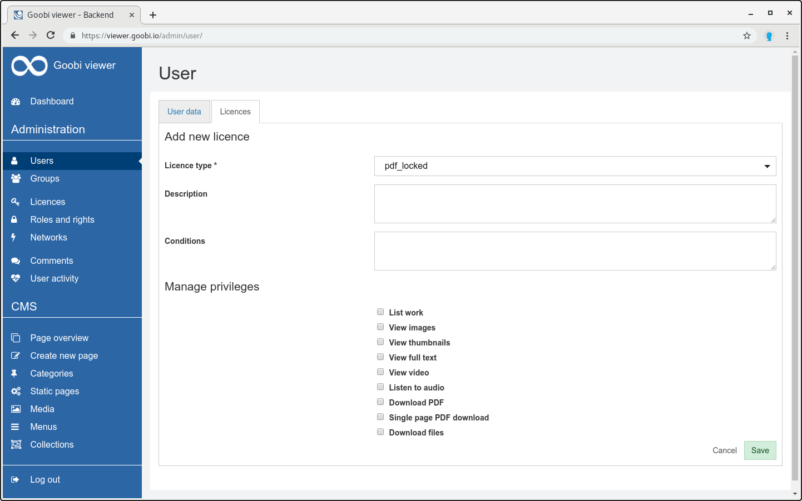

# 6.7.2 Lizenzen

Die durch die Konfiguration von Lizenztypen geltenden Einschränkungen für normale Benutzer können durch die Vergabe von Lizenzen an Lizenznehmer wieder teilweise oder ganz aufgehoben werden. Lizenznehmer können einzelne Benutzer, Benutzergruppen oder definierte IP-Bereiche sein.

Um eine Lizenz zu vergeben muss der entsprechende Lizenznehmer zunächst im Bearbeitungsmodus geöffnet werden. Dort befindet sich der Reiter "Lizenzen", auf dem, sofern vorhanden, bereits vergebene Lizenzen aufgelistet sind. Über den Link "Neue Lizenz hinzufügen" gelangt man zur Erstellungsseite, welche der Erstellungsseite für Lizenztypen sehr ähnlich aufgebaut ist und folgende Felder enthält:

| **Feld**  | Beschreibung |
| :--- | :--- |
| **Lizenztyp** | Drown-Down-Auswahl des Lizenztyps, für den diese Lizenz gelten soll. Der Lizenztyp muss bereits existieren. |
| **Beschreibung** | Freitext-Beschreibung zu dieser Lizenz. |
| **Bedingungen**  | Eine optionale Solr-Query, um den Wirkungskreis dieser Lizenz auf bestimmte Werke einzuschränken. Dies bedeutet, dass die durch diese Lizenz vergebenen Berechtigungen  nur für Werke, die dieser Query entsprechen, gelten. Auf alle anderen Werke, die zu diesem Lizenztyp gehören, hat diese Lizenz keine Auswirkung. |
| **Rechte verwalten**  | Hier können zusätzlich zu den im Lizenztyp definierten Standardberechtigungen weitere Berechtigungen vergeben werden. Schalter für Berechtigungen, die bereits im ausgewählten Lizentyp als Standardbrerechtigungen definiert sind, sind hier deaktiviert. |

